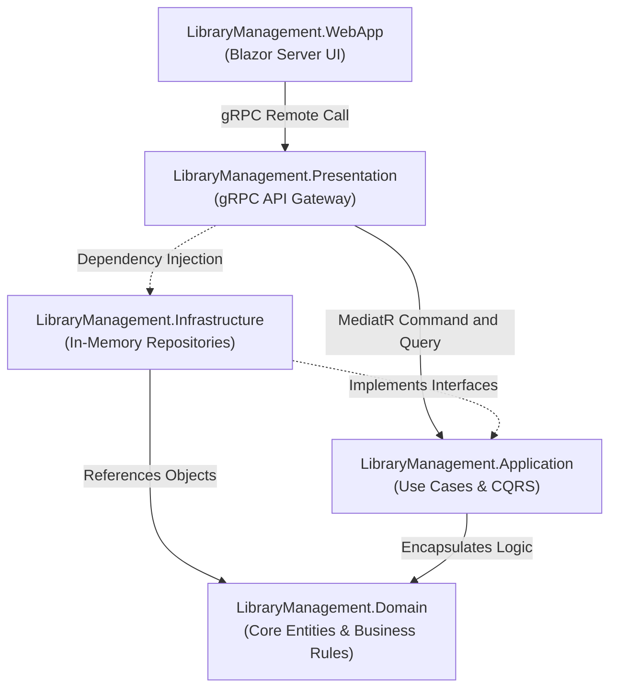

# TÀI LIỆU KỸ THUẬT: HỆ THỐNG QUẢN LÝ THƯ VIỆN

## I. Phân tích thiết kế

*(Phần này đang để trống - sẽ được bổ sung tài liệu sơ đồ thiết kế/UML chi tiết sau)*

---

## II. Triển khai hệ thống

### 1. Tổng quan Kiến trúc

Dự án Hệ thống Quản lý Thư viện được phát triển dựa trên mô hình Clean Architecture. Thiết kế này giúp định tuyến rõ ràng giữa logic nghiệp vụ và các khía cạnh kỹ thuật (cơ sở dữ liệu, giao diện, API giao tiếp).

#### 1.1 Sơ đồ Cấu trúc Phụ thuộc (Dependency Diagram)
Sơ đồ dưới đây thể hiện "The Dependency Rule" (Quy tắc phụ thuộc hướng tâm) được áp dụng nghiêm ngặt trong dự án. Các mũi tên liền mạch thể hiện tham chiếu Project (Project Reference), mũi tên đứt nét thể hiện triển khai kỹ thuật (Interface Implementation & DI).



#### 1.2 Triết lý thiết kế Clean Architecture


Kiến trúc Clean Architecture được áp dụng nhằm khắc phục những sự phụ thuộc cấu trúc của các mô hình truyền thống (N-Tier/MVC). Triết lý thiết kế này định hình hệ thống thông qua các nguyên lý cốt lõi:
- **Độc lập nền tảng công nghệ (Framework Independence):** Điểm cốt lõi là việc cô lập vùng nghiệp vụ (Tầng Domain và Application) khỏi các công cụ kỹ thuật như Cơ sở dữ liệu hay Giao diện người dùng (UI). Các quy tắc thư viện như thuật toán tính phí phạt hay giới hạn mượn/trả luôn được đóng gói chặt chẽ và độc lập tuyệt đối.
- **Quy tắc Phụ thuộc Hướng tâm (The Dependency Rule):** Luồng tham chiếu mã nguồn (Source Code Dependencies) được quy định chặt chẽ luôn hướng từ các lớp bên ngoài vào lớp trung tâm. Tầng Domain là thực thể độc quyền độc lập, không chấp nhận bất kỳ tham chiếu ngoại vi nào.
- **Khả năng tháo lắp linh hoạt (Pluggability & Maintainability):** Thông qua nguyên lý Đảo ngược Phụ thuộc (Dependency Inversion), các thành phần ở cấp thấp như luồng lưu trữ liệu (In-Memory Storage, Entity Framework) hoặc giao diện điểm cuối (Blazor Server) chỉ đóng vai trò như các Plugin mở rộng (Extensions). Việc nâng cấp hoặc thay thế công nghệ hạ tầng trở nên tối ưu mà không tác động tiêu cực (Side-effects) đến cấu trúc lõi của phần mềm.

#### 1.3 Các kỹ thuật và mẫu thiết kế bổ trợ (Design Patterns)
Các kiến trúc và mẫu thiết kế cốt lõi được ứng dụng bao gồm:
- **CQRS (Command Query Responsibility Segregation):** Tách bạch rõ ràng luồng thay đổi trạng thái hệ thống (Commands như Mượn/Trả/Gia hạn) và luồng truy vấn (Queries như Lấy danh sách kho).
- **Mediator Pattern (thông qua MediatR):** Đóng vai trò làm trạm trung chuyển (Traffic Controller), triệt tiêu sự phụ thuộc (Coupling) giữa tầng Presentation (Web API) và tầng Application (Logic).
- **Repository Pattern & Unit of Work:** Trừu tượng hóa hoàn toàn lớp truy xuất dữ liệu (Data Access Layer). Gói gọn các thao tác lưu trữ nhiều bản ghi cục bộ vào một khối giao dịch an toàn.
- **Dependency Injection (DI) Pattern:** Mọi tầng đều giao tiếp thông qua Interface. Toàn bộ chuỗi cung ứng service được tiêm vào Constructor vòng đời ứng dụng (Inversion of Control).
- **Domain-Driven Design (DDD) Concepts:** Áp dụng mô hình **Rich Domain Model** (đưa hành vi thay đổi trạng thái vào tận bên trong Entity như việc Cập nhật số lượng sách trong thẻ độc giả). Hệ thống cũng dùng các **Domain Exceptions** đặc chế để bảo trợ quy tắc nghiệp vụ khép kín.
- **RPC Pattern (gRPC & Protocol Buffers):** Thay thế REST API truyền thống, định nghĩa hợp đồng nhị phân (Contract-First) giúp giao tiếp tốc độ siêu cao giữa WebApp và Backend.
- **Thread-safe Singleton DataStore:** Ứng dụng `ConcurrentDictionary` để mô phỏng một kho Cơ sở dữ liệu chống dẫm chân (Race-condition) tuyệt đối ngay bên trong RAM thời gian thực.

---

### 2. Quá trình Khởi tạo và Cấu hình Project

Dự án được khởi tạo thông qua .NET CLI. Các bước sau liệt kê quá trình lập cấu trúc source code cơ sở:

```bash
# 1. Tạo Solution
dotnet new sln -n LibraryManagement

# 2. Tạo 5 projects (tương ứng với các tầng)
dotnet new classlib -n LibraryManagement.Domain
dotnet new classlib -n LibraryManagement.Application
dotnet new classlib -n LibraryManagement.Infrastructure
dotnet new grpc -n LibraryManagement.Presentation
dotnet new blazorserver -n LibraryManagement.WebApp

# 3. Đưa các projects vào Solution
dotnet sln add LibraryManagement.Domain/LibraryManagement.Domain.csproj
dotnet sln add LibraryManagement.Application/LibraryManagement.Application.csproj
dotnet sln add LibraryManagement.Infrastructure/LibraryManagement.Infrastructure.csproj
dotnet sln add LibraryManagement.Presentation/LibraryManagement.Presentation.csproj
dotnet sln add LibraryManagement.WebApp/LibraryManagement.WebApp.csproj

# 4. Cấu hình Dependencies (áp dụng tham chiếu tâm)
dotnet add LibraryManagement.Application/LibraryManagement.Application.csproj reference LibraryManagement.Domain/LibraryManagement.Domain.csproj

dotnet add LibraryManagement.Infrastructure/LibraryManagement.Infrastructure.csproj reference LibraryManagement.Application/LibraryManagement.Application.csproj
dotnet add LibraryManagement.Infrastructure/LibraryManagement.Infrastructure.csproj reference LibraryManagement.Domain/LibraryManagement.Domain.csproj

dotnet add LibraryManagement.Presentation/LibraryManagement.Presentation.csproj reference LibraryManagement.Application/LibraryManagement.Application.csproj
dotnet add LibraryManagement.Presentation/LibraryManagement.Presentation.csproj reference LibraryManagement.Infrastructure/LibraryManagement.Infrastructure.csproj

# 5. Cài đặt các thư viện package mở rộng
dotnet add LibraryManagement.Application/LibraryManagement.Application.csproj package MediatR
dotnet add LibraryManagement.Presentation/LibraryManagement.Presentation.csproj package Grpc.AspNetCore
dotnet add LibraryManagement.WebApp/LibraryManagement.WebApp.csproj package Grpc.Net.Client

# 6. Thiết lập thư mục cơ bản
mkdir -p LibraryManagement.Application/Features/Borrowing/Commands
mkdir -p LibraryManagement.Application/Features/Borrowing/Queries
mkdir -p LibraryManagement.Application/Features/Borrowing/DTOs
mkdir -p LibraryManagement.Application/Interfaces

mkdir -p LibraryManagement.Domain/Entities
mkdir -p LibraryManagement.Domain/Enums
mkdir -p LibraryManagement.Domain/Exceptions

rm LibraryManagement.Domain/Class1.cs
rm LibraryManagement.Application/Class1.cs
rm LibraryManagement.Infrastructure/Class1.cs
```

---

### 3. Cấu trúc thư mục hệ thống

- **LibraryManagement.Domain**: Chứa định nghĩa các Entities, Enums, và Exceptions cốt lõi theo đặc tả nghiệp vụ.
- **LibraryManagement.Application**: Chứa định nghĩa các interface trừu tượng và triển khai Handler cho Use cases điều hướng bởi MediatR.
- **LibraryManagement.Infrastructure**: Tập trung logic cập nhật / truy vấn dữ liệu từ bộ nhớ ứng dụng.
- **LibraryManagement.Presentation**: gRPC endpoint phục vụ yêu cầu từ các client.
- **LibraryManagement.WebApp**: Hệ thống Web UI dựa vào SSR của Blazor Server.

---

### 4. Chi tiết triển khai và Source code
#### Tầng Domain

**1. Vai trò:**
Tầng Domain là cốt lõi của Kiến trúc Sạch (Clean Architecture). Tầng này hoàn toàn độc lập, không tham chiếu đến bất kỳ dự án hay thư viện ngoại vi nào (không EF Core, không ASP.NET). Điều này đảm bảo logic nghiệp vụ được bảo vệ khỏi sự thay đổi của công nghệ bên ngoài.

**2. Thành phần kỹ thuật:**
- **Entities (Thực thể):** Triển khai theo mô hình Rich Domain Model thay vì Anemic Domain Model. Các thực thể như DocGia, CuonSach, PhieuPhat không chỉ là các cấu trúc dữ liệu thuần túy (chứa properties getter/setter) mà còn chứa trọn vẹn logic tự thân. Ví dụ, DocGia có phương thức tự động quản trị số lượng sách đang mượn hoặc ném lỗi nếu thẻ hết hạn.
- **Exceptions (Ngoại lệ Nghiệp vụ):** Toàn bộ các quy tắc rào cản (Business Rules) được mô hình hóa thành Exception chuyên biệt như LimitExceededException hay ReaderLockedException.
- **Enums:** Chuẩn hóa các trạng thái tĩnh (Trạng thái sách, Trạng thái tài khoản).

**3. Cơ chế hoạt động:**
Bất kỳ thành phần nào muốn giao tiếp hoặc xoay chuyển trạng thái của dữ liệu đều phải đi qua các hàm được public của Entities, đảm bảo tính Đóng gói (Encapsulation) tuyệt đối.

- **File:** `LibraryManagement.Domain\Exceptions\AlreadyReservedException.cs` 

```csharp
namespace LibraryManagement.Domain.Exceptions;

public class AlreadyReservedException : LibraryManagementException
{
    public AlreadyReservedException(string message = "Bạn đã đặt trước cuốn sách này rồi.") : base(message) { }
}

```

- **File:** `LibraryManagement.Domain\Exceptions\BookAlreadyReservedException.cs` 

```csharp
namespace LibraryManagement.Domain.Exceptions;

public class BookAlreadyReservedException : LibraryManagementException
{
    public BookAlreadyReservedException(string message = "Sách đã được người khác đặt trước.") : base(message) { }
}

```

- **File:** `LibraryManagement.Domain\Exceptions\BookNotAvailableException.cs` 

```csharp
namespace LibraryManagement.Domain.Exceptions;

public class BookNotAvailableException : LibraryManagementException
{
    public BookNotAvailableException(string message = "Sách hiện không sẵn sàng để mượn.") : base(message) { }
}

```

- **File:** `LibraryManagement.Domain\Exceptions\BookOverdueException.cs` 

```csharp
namespace LibraryManagement.Domain.Exceptions;

public class BookOverdueException : LibraryManagementException
{
    public BookOverdueException(string message = "Sách đã quá hạn, không thể gia hạn thêm.") : base(message) { }
}

```

- **File:** `LibraryManagement.Domain\Exceptions\CopiesAvailableException.cs` 

```csharp
namespace LibraryManagement.Domain.Exceptions;

public class CopiesAvailableException : LibraryManagementException
{
    public CopiesAvailableException(string message = "Sách hiện có sẵn trên kệ, vui lòng mượn trực tiếp (không cần đặt trước).") : base(message) { }
}

```

- **File:** `LibraryManagement.Domain\Entities\CuonSach.cs` 
- **Mô tả nhiệm vụ:** *Thực thể hiện vật đại diện cho một quyển sách cụ thể (phân biệt qua RFID).*

```csharp
using LibraryManagement.Domain.Enums;

namespace LibraryManagement.Domain.Entities;

public class CuonSach
{
    public string Id { get; set; } = string.Empty;
    public string MaVachRFID { get; set; } = string.Empty;
    public TinhTrangVatLy TinhTrangVatLy { get; set; }
    public TrangThaiCuonSach TrangThai { get; set; }
    
    // Foreign Key
    public string DauSachId { get; set; } = string.Empty;
    public string ISBN { get; set; } = string.Empty; // Keep ISBN for backward compatibility with existing code
    public virtual DauSach DauSach { get; set; } = null!;

    // Navigation properties
    public virtual ICollection<GiaoDichMuonTra> GiaoDichMuonTras { get; set; } = new List<GiaoDichMuonTra>();
}

```

- **File:** `LibraryManagement.Domain\Entities\DauSach.cs` 
- **Mô tả nhiệm vụ:** *Thực thể danh mục chứa thông tin meta (ISBN, Tên sách, Tác giả).*

```csharp
namespace LibraryManagement.Domain.Entities;

public class DauSach
{
    public string Id { get; set; } = string.Empty;
    public string ISBN { get; set; } = string.Empty;
    public string TenSach { get; set; } = string.Empty;
    public string TacGia { get; set; } = string.Empty;
    public string TheLoai { get; set; } = string.Empty;
    public string NhaXuatBan { get; set; } = string.Empty;

    // Navigation properties
    public virtual ICollection<CuonSach> CuonSachs { get; set; } = new List<CuonSach>();
    public virtual ICollection<PhieuDatTruoc> PhieuDatTruocs { get; set; } = new List<PhieuDatTruoc>();

    public void KiemTraThongTin()
    {
        // Implementation logic
    }
}

```

- **File:** `LibraryManagement.Domain\Entities\DocGia.cs` 
- **Mô tả nhiệm vụ:** *Quản lý thông tin tài khoản người dùng và hạn thẻ.*

```csharp
using LibraryManagement.Domain.Enums;

namespace LibraryManagement.Domain.Entities;

public class DocGia : NguoiDung
{
    public string MaThe { get; set; } = string.Empty;
    public string LoaiThe { get; set; } = string.Empty;
    public DateTime NgayHetHanThe { get; set; }
    public int SoSachDangMuon { get; set; }
    public double TongNoPhat { get; set; }
    public TrangThaiTaiKhoan TrangThaiTaiKhoan { get; set; }

    // Navigation properties
    public virtual ICollection<PhieuDatTruoc> PhieuDatTruocs { get; set; } = new List<PhieuDatTruoc>();
    public virtual ICollection<GiaoDichMuonTra> GiaoDichMuonTras { get; set; } = new List<GiaoDichMuonTra>();
    public virtual ICollection<PhieuPhat> PhieuPhats { get; set; } = new List<PhieuPhat>();

    public bool KiemTraHopLe()
    {
        return NgayHetHanThe > DateTime.Now && TrangThaiTaiKhoan == TrangThaiTaiKhoan.BinhThuong;
    }

    public void CapNhatSoSachMuon(int soLuong)
    {
        SoSachDangMuon += soLuong;
    }
}

```

- **File:** `LibraryManagement.Domain\Entities\GiaoDichMuonTra.cs` 
- **Mô tả nhiệm vụ:** *Ghi nhận tiến trình mượn/trả, dùng để tính toán trễ hạn.*

```csharp
using LibraryManagement.Domain.Enums;

namespace LibraryManagement.Domain.Entities;

public class GiaoDichMuonTra
{
    public string Id { get; set; } = string.Empty; // Formerly MaGiaoDich
    public DateTime NgayMuon { get; set; }
    public DateTime NgayDenHan { get; set; }
    public DateTime? NgayTraThucTe { get; set; }
    public int SoLanGiaHan { get; set; }
    public TrangThaiGiaoDich TrangThaiGD { get; set; }

    // Foreign Keys
    public string DocGiaId { get; set; } = string.Empty; 
    public string MaThe { get; set; } = string.Empty; // Keep MaThe for existing code
    public virtual DocGia DocGia { get; set; } = null!;

    public string MaNguoiDungThuThu { get; set; } = string.Empty;
    public virtual ThuThu ThuThu { get; set; } = null!;

    public string MaVachRFID { get; set; } = string.Empty;
    public virtual CuonSach CuonSach { get; set; } = null!; // Actually, prompt said 1-N. Let's keep it 1-N but simplify mapping.

    // Navigation properties
    public virtual ICollection<CuonSach> CuonSachs { get; set; } = new List<CuonSach>();
    public virtual ICollection<PhieuPhat> PhieuPhats { get; set; } = new List<PhieuPhat>();

    public DateTime TinhNgayDenHan()
    {
        return NgayDenHan;
    }

    public bool KiemTraQuaHan()
    {
        return (NgayTraThucTe ?? DateTime.Now) > NgayDenHan;
    }

    public bool GiaHanSach()
    {
        if (SoLanGiaHan < 3) // Example limit
        {
            SoLanGiaHan++;
            NgayDenHan = NgayDenHan.AddDays(7);
            return true;
        }
        return false;
    }
}

```

- **File:** `LibraryManagement.Domain\Exceptions\LibraryManagementException.cs` 
- **Mô tả nhiệm vụ:** *Ngoại lệ nghiệp vụ gốc (Domain Exception), dùng để bọc các vi phạm quy tắc.*

```csharp
namespace LibraryManagement.Domain.Exceptions;

public class LibraryManagementException : Exception
{
    public LibraryManagementException(string message) : base(message) { }
}

```

- **File:** `LibraryManagement.Domain\Exceptions\LimitExceededException.cs` 
- **Mô tả nhiệm vụ:** *Bắt lỗi khi độc giả mượn hoặc gia hạn quá định mức cho phép.*

```csharp
namespace LibraryManagement.Domain.Exceptions;

public class LimitExceededException : LibraryManagementException
{
    public LimitExceededException(string message = "Vượt quá hạn mức cho phép.") : base(message) { }
}

```

- **File:** `LibraryManagement.Domain\Entities\NguoiDung.cs` 

```csharp
namespace LibraryManagement.Domain.Entities;

public abstract class NguoiDung
{
    public string Id { get; set; } = string.Empty;
    public string HoTen { get; set; } = string.Empty;
    public string Email { get; set; } = string.Empty;
    public string SoDienThoai { get; set; } = string.Empty;
}

```

- **File:** `LibraryManagement.Domain\Entities\PhieuDatTruoc.cs` 
- **Mô tả nhiệm vụ:** *Lưu vết yêu cầu đặt chỗ đợi ấn bản trả về.*

```csharp
namespace LibraryManagement.Domain.Entities;

public class PhieuDatTruoc
{
    public string Id { get; set; } = string.Empty;
    public DateTime NgayDat { get; set; }
    public DateTime NgayHetHanNhan { get; set; }
    public string TrangThai { get; set; } = string.Empty;

    // Foreign Keys
    public string MaThe { get; set; } = string.Empty;
    public virtual DocGia DocGia { get; set; } = null!;

    public string ISBN { get; set; } = string.Empty;
    public virtual DauSach DauSach { get; set; } = null!;

    public void GuiThongBao()
    {
        // Implementation logic
    }

    public void HuyDatTruoc()
    {
        // Implementation logic
    }
}

```

- **File:** `LibraryManagement.Domain\Entities\PhieuPhat.cs` 
- **Mô tả nhiệm vụ:** *Thực thể ghi chú hóa đơn lỗi khi người dùng làm hỏng sách hoặc trễ hạn.*

```csharp
using LibraryManagement.Domain.Enums;

namespace LibraryManagement.Domain.Entities;

public class PhieuPhat
{
    public string Id { get; set; } = string.Empty; // Formerly MaPhieuPhat
    public string LyDoPhat { get; set; } = string.Empty;
    public double SoTienPhat { get; set; }
    public TrangThaiThanhToan TrangThaiThanhToan { get; set; }
    public DateTime NgayLapPhieu { get; set; }

    // Foreign Keys
    public string DocGiaId { get; set; } = string.Empty;
    public string MaThe { get; set; } = string.Empty; // Keep for existing code
    public virtual DocGia DocGia { get; set; } = null!;

    public string MaNguoiDungThuThu { get; set; } = string.Empty;
    public virtual ThuThu ThuThu { get; set; } = null!;

    public string GiaoDichMuonTraId { get; set; } = string.Empty;
    public virtual GiaoDichMuonTra GiaoDichMuonTra { get; set; } = null!;

    public double TinhTienPhat()
    {
        return SoTienPhat;
    }

    public void XacNhanThanhToan()
    {
        TrangThaiThanhToan = TrangThaiThanhToan.DaThanhToan;
    }
}

```

- **File:** `LibraryManagement.Domain\Exceptions\ReaderExpiredException.cs` 

```csharp
namespace LibraryManagement.Domain.Exceptions;

public class ReaderExpiredException : LibraryManagementException
{
    public ReaderExpiredException(string message = "Thẻ độc giả đã hết hạn.") : base(message) { }
}

```

- **File:** `LibraryManagement.Domain\Exceptions\ReaderLockedException.cs` 

```csharp
namespace LibraryManagement.Domain.Exceptions;

public class ReaderLockedException : LibraryManagementException
{
    public ReaderLockedException(string message = "Tài khoản độc giả đang bị khóa.") : base(message) { }
}

```

- **File:** `LibraryManagement.Domain\Entities\ThuThu.cs` 

```csharp
namespace LibraryManagement.Domain.Entities;

public class ThuThu : NguoiDung
{
    public string CaLamViec { get; set; } = string.Empty;

    // Navigation properties
    public virtual ICollection<GiaoDichMuonTra> GiaoDichMuonTras { get; set; } = new List<GiaoDichMuonTra>();
    public virtual ICollection<PhieuPhat> PhieuPhats { get; set; } = new List<PhieuPhat>();

    public void TaoGiaoDich()
    {
        // Implementation logic
    }

    public void XuLyPhat()
    {
        // Implementation logic
    }
}

```

- **File:** `LibraryManagement.Domain\Enums\TinhTrangVatLy.cs` 

```csharp
namespace LibraryManagement.Domain.Enums;

public enum TinhTrangVatLy
{
    BinhThuong,
    Rach,
    Uot
}

```

- **File:** `LibraryManagement.Domain\Enums\TrangThaiCuonSach.cs` 

```csharp
namespace LibraryManagement.Domain.Enums;

public enum TrangThaiCuonSach
{
    SanSang,
    DangMuon,
    DaDatTruoc,
    HuHong
}

```

- **File:** `LibraryManagement.Domain\Enums\TrangThaiGiaoDich.cs` 

```csharp
namespace LibraryManagement.Domain.Enums;

public enum TrangThaiGiaoDich
{
    DangMuon,
    DaTra,
    TreHan
}

```

- **File:** `LibraryManagement.Domain\Enums\TrangThaiTaiKhoan.cs` 

```csharp
namespace LibraryManagement.Domain.Enums;

public enum TrangThaiTaiKhoan
{
    BinhThuong,
    Khoa
}

```

- **File:** `LibraryManagement.Domain\Enums\TrangThaiThanhToan.cs` 

```csharp
namespace LibraryManagement.Domain.Enums;

public enum TrangThaiThanhToan
{
    ChuaThanhToan,
    DaThanhToan
}

```

#### Tầng Application

**1. Vai trò:**
Tầng Application định nghĩa và điều phối tất cả các Use Case (Luồng tính năng) của hệ thống quản lý thư viện. Tầng này chỉ phụ thuộc vào tầng Domain.

**2. Thành phần kỹ thuật:**
- **CQRS (Command Query Responsibility Segregation):** Mã nguồn được chia tách rõ rệt dựa trên hành vi:
  - Commands: Chịu trách nhiệm thay đổi trạng thái hệ thống (Mutate state) như Mượn sách (BorrowBookCommand), Trả sách, Thu phạt.
  - Queries: Chịu trách nhiệm chỉ múc dữ liệu phục vụ hiển thị (GetBooksQuery) mà không làm thay đổi state.
- **MediatR (Design Pattern Mediator):** Thay vì các module gọi chéo nhau tạo ra Dependency Hell, mọi truy vấn được gửi vào một đầu mối IMediator. Sau đó luồng được tự động phân bổ về đúng class Handler (ví dụ BorrowBookCommandHandler) giúp mã nguồn đạt độ quy chuẩn Single Responsibility Principle (SRP) tối đa.
- **Interfaces (Hợp đồng):** Tầng này định nghĩa các khuôn mẫu IUnitOfWork, IRepository... ứng dụng triệt để nguyên lý Dependency Inversion của SOLID. Hạ tầng phải nương theo Application chứ không phải chiều ngược lại.

- **File:** `LibraryManagement.Application\Features\Borrowing\Commands\BorrowBookCommand.cs` 

```csharp
using MediatR;

namespace LibraryManagement.Application.Features.Borrowing.Commands;

public class BorrowBookCommand : IRequest<bool>
{
    public string MaTheDocGia { get; set; } = string.Empty;
    public List<string> DanhSachMaVachRFID { get; set; } = new();
}
```

- **File:** `LibraryManagement.Application\Features\Borrowing\Commands\BorrowBookCommandHandler.cs` 
- **Mô tả nhiệm vụ:** *Điều phối quy trình Truy xuất UC-01, xác thực thẻ và trạng thái sách trước khi lập giao dịch.*

```csharp
using MediatR;
using LibraryManagement.Application.Interfaces;
using LibraryManagement.Domain.Entities;
using LibraryManagement.Domain.Enums;
using LibraryManagement.Domain.Exceptions;

namespace LibraryManagement.Application.Features.Borrowing.Commands;

public class BorrowBookCommandHandler : IRequestHandler<BorrowBookCommand, bool>
{
    private readonly IDocGiaRepository _docGiaRepository;
    private readonly ICuonSachRepository _cuonSachRepository;
    private readonly IGiaoDichMuonTraRepository _giaoDichRepository;
    private readonly IUnitOfWork _unitOfWork;

    public BorrowBookCommandHandler(
        IDocGiaRepository docGiaRepository,
        ICuonSachRepository cuonSachRepository,
        IGiaoDichMuonTraRepository giaoDichRepository,
        IUnitOfWork unitOfWork)
    {
        _docGiaRepository = docGiaRepository;
        _cuonSachRepository = cuonSachRepository;
        _giaoDichRepository = giaoDichRepository;
        _unitOfWork = unitOfWork;
    }

    public async Task<bool> Handle(BorrowBookCommand request, CancellationToken cancellationToken)
    {
        // 1. Fetch reader
        var docGia = await _docGiaRepository.GetByMaTheAsync(request.MaTheDocGia);
        if (docGia == null) throw new Exception("Không tìm thấy thông tin Thẻ độc giả.");

        // 2 & 3. Validations
        if (docGia.NgayHetHanThe < DateTime.Now)
            throw new ReaderExpiredException();
        if (docGia.TrangThaiTaiKhoan == TrangThaiTaiKhoan.Khoa)
            throw new ReaderLockedException();
        
        // 4. Limit check
        if (docGia.SoSachDangMuon + request.DanhSachMaVachRFID.Count > 5)
            throw new LimitExceededException("Số sách mượn vượt quá hạn mức tối đa (5 cuốn).");

        // 5. Process each book
        var giaoDichMuonTras = new List<GiaoDichMuonTra>();
        foreach (var rfid in request.DanhSachMaVachRFID)
        {
            var cuonSach = await _cuonSachRepository.GetByMaVachAsync(rfid);
            if (cuonSach == null || cuonSach.TrangThai != TrangThaiCuonSach.SanSang)
            {
                throw new BookNotAvailableException($"Cuốn sách mã {rfid} không sẵn sàng để mượn.");
            }

            // Update state
            cuonSach.TrangThai = TrangThaiCuonSach.DangMuon;
            await _cuonSachRepository.UpdateAsync(cuonSach);

            // Create transaction
            var giaoDich = new GiaoDichMuonTra
            {
                Id = Guid.NewGuid().ToString(),
                MaThe = docGia.MaThe,
                MaVachRFID = rfid,
                NgayMuon = DateTime.Now,
                NgayDenHan = DateTime.Now.AddDays(14),
                SoLanGiaHan = 0,
                TrangThaiGD = TrangThaiGiaoDich.DangMuon
            };
            
            await _giaoDichRepository.AddAsync(giaoDich);
        }

        // 6. Update reader's book count
        docGia.CapNhatSoSachMuon(request.DanhSachMaVachRFID.Count);
        await _docGiaRepository.UpdateAsync(docGia);

        // 7. Save changes
        await _unitOfWork.SaveChangesAsync(cancellationToken);

        return true;
    }
}

```

- **File:** `LibraryManagement.Application\DependencyInjection.cs` 

```csharp
using Microsoft.Extensions.DependencyInjection;
using System.Reflection;

namespace LibraryManagement.Application
{
    public static class DependencyInjection
    {
        public static IServiceCollection AddApplicationServices(this IServiceCollection services)
        {
            services.AddMediatR(cfg => cfg.RegisterServicesFromAssembly(Assembly.GetExecutingAssembly()));
            return services;
        }
    }
}

```

- **File:** `LibraryManagement.Application\Features\Books\Queries\GetBooksQuery.cs` 

```csharp
using MediatR;
using LibraryManagement.Application.Interfaces;
using LibraryManagement.Domain.Enums;

namespace LibraryManagement.Application.Features.Books.Queries;

public class BookDto
{
    public string MaVachRFID { get; set; } = string.Empty;
    public string TenSach { get; set; } = string.Empty;
    public string ISBN { get; set; } = string.Empty;
    public string TrangThai { get; set; } = string.Empty;
}

public class GetBooksQuery : IRequest<List<BookDto>>
{
}

```

- **File:** `LibraryManagement.Application\Features\Books\Queries\GetBooksQueryHandler.cs` 

```csharp
using MediatR;
using LibraryManagement.Application.Interfaces;

namespace LibraryManagement.Application.Features.Books.Queries;

public class GetBooksQueryHandler : IRequestHandler<GetBooksQuery, List<BookDto>>
{
    private readonly ICuonSachRepository _cuonSachRepository;

    public GetBooksQueryHandler(ICuonSachRepository cuonSachRepository)
    {
        _cuonSachRepository = cuonSachRepository;
    }

    public async Task<List<BookDto>> Handle(GetBooksQuery request, CancellationToken cancellationToken)
    {
        var tatCaSach = await _cuonSachRepository.GetAllAsync();
        
        return tatCaSach.Select(s => new BookDto
        {
            MaVachRFID = s.MaVachRFID,
            TenSach = s.DauSach?.TenSach ?? "Không Tên",
            ISBN = s.ISBN,
            TrangThai = s.TrangThai.ToString()
        }).ToList();
    }
}

```

- **File:** `LibraryManagement.Application\Interfaces\ICuonSachRepository.cs` 

```csharp
using LibraryManagement.Domain.Entities;

namespace LibraryManagement.Application.Interfaces;

public interface ICuonSachRepository
{
    Task<CuonSach?> GetByMaVachAsync(string maVachRfid);
    Task<IEnumerable<CuonSach>> GetByIsbnAsync(string isbn);
    Task<IEnumerable<CuonSach>> GetAllAsync();
    Task UpdateAsync(CuonSach cuonSach);
}

```

- **File:** `LibraryManagement.Application\Interfaces\IDocGiaRepository.cs` 

```csharp
using LibraryManagement.Domain.Entities;

namespace LibraryManagement.Application.Interfaces;

public interface IDocGiaRepository
{
    Task<DocGia?> GetByMaTheAsync(string maThe);
    Task UpdateAsync(DocGia docGia);
}

```

- **File:** `LibraryManagement.Application\Interfaces\IGiaoDichMuonTraRepository.cs` 

```csharp
using LibraryManagement.Domain.Entities;

namespace LibraryManagement.Application.Interfaces;

public interface IGiaoDichMuonTraRepository
{
    Task<GiaoDichMuonTra?> GetActiveTransactionByBookAsync(string maVachRfid);
    Task<IEnumerable<GiaoDichMuonTra>> GetActiveTransactionsByReaderAsync(string maThe);
    Task<IEnumerable<GiaoDichMuonTra>> GetAllActiveTransactionsAsync();
    Task AddAsync(GiaoDichMuonTra giaoDich);
    Task UpdateAsync(GiaoDichMuonTra giaoDich);
}

```

- **File:** `LibraryManagement.Application\Interfaces\IPhieuDatTruocRepository.cs` 

```csharp
using LibraryManagement.Domain.Entities;

namespace LibraryManagement.Application.Interfaces;

public interface IPhieuDatTruocRepository
{
    Task<PhieuDatTruoc?> GetActiveReservationByIsbnAsync(string isbn);
    Task<IEnumerable<PhieuDatTruoc>> GetActiveReservationsByReaderAsync(string maThe);
    Task AddAsync(PhieuDatTruoc phieuDatTruoc);
    Task UpdateAsync(PhieuDatTruoc phieuDatTruoc);
}

```

- **File:** `LibraryManagement.Application\Interfaces\IPhieuPhatRepository.cs` 

```csharp
using LibraryManagement.Domain.Entities;

namespace LibraryManagement.Application.Interfaces;

public interface IPhieuPhatRepository
{
    Task<IEnumerable<PhieuPhat>> GetUnpaidFinesByReaderAsync(string maThe);
    Task AddAsync(PhieuPhat phieuPhat);
    Task UpdateManyAsync(IEnumerable<PhieuPhat> phieuPhats);
}

```

- **File:** `LibraryManagement.Application\Interfaces\IUnitOfWork.cs` 

```csharp
namespace LibraryManagement.Application.Interfaces;

public interface IUnitOfWork
{
    Task<int> SaveChangesAsync(CancellationToken cancellationToken = default);
}

```

- **File:** `LibraryManagement.Application\Features\Fines\Commands\PayFineCommand.cs` 

```csharp
using MediatR;

namespace LibraryManagement.Application.Features.Fines.Commands;

public class PayFineCommand : IRequest<double>
{
    public string MaTheDocGia { get; set; } = string.Empty;
}

```

- **File:** `LibraryManagement.Application\Features\Fines\Commands\PayFineCommandHandler.cs` 
- **Mô tả nhiệm vụ:** *Kích hoạt vòng lặp chốt toán dư nợ, đồng thời phục hồi thẻ (Unlock).*

```csharp
using MediatR;
using LibraryManagement.Application.Interfaces;
using LibraryManagement.Domain.Enums;

namespace LibraryManagement.Application.Features.Fines.Commands;

public class PayFineCommandHandler : IRequestHandler<PayFineCommand, double>
{
    private readonly IPhieuPhatRepository _phieuPhatRepository;
    private readonly IDocGiaRepository _docGiaRepository;
    private readonly IUnitOfWork _unitOfWork;

    public PayFineCommandHandler(
        IPhieuPhatRepository phieuPhatRepository,
        IDocGiaRepository docGiaRepository,
        IUnitOfWork unitOfWork)
    {
        _phieuPhatRepository = phieuPhatRepository;
        _docGiaRepository = docGiaRepository;
        _unitOfWork = unitOfWork;
    }

    public async Task<double> Handle(PayFineCommand request, CancellationToken cancellationToken)
    {
        var unpaidFines = await _phieuPhatRepository.GetUnpaidFinesByReaderAsync(request.MaTheDocGia);
        if (!unpaidFines.Any())
            return 0;

        double totalPaid = 0;
        foreach (var fine in unpaidFines)
        {
            fine.TrangThaiThanhToan = TrangThaiThanhToan.DaThanhToan;
            totalPaid += fine.SoTienPhat;
        }

        await _phieuPhatRepository.UpdateManyAsync(unpaidFines);

        var docGia = await _docGiaRepository.GetByMaTheAsync(request.MaTheDocGia);
        if (docGia != null)
        {
            docGia.TrangThaiTaiKhoan = TrangThaiTaiKhoan.BinhThuong;
            await _docGiaRepository.UpdateAsync(docGia);
        }

        await _unitOfWork.SaveChangesAsync(cancellationToken);

        return totalPaid; // Trả về số tiền đã thu để in biên lai
    }
}

```

- **File:** `LibraryManagement.Application\Features\Renewing\Commands\RenewBookCommand.cs` 

```csharp
using MediatR;

namespace LibraryManagement.Application.Features.Renewing.Commands;

public class RenewBookCommand : IRequest<bool>
{
    public string MaTheDocGia { get; set; } = string.Empty;
    public List<string> DanhSachMaVachRFID { get; set; } = new();
}

```

- **File:** `LibraryManagement.Application\Features\Renewing\Commands\RenewBookCommandHandler.cs` 
- **Mô tả nhiệm vụ:** *Xử lý UC-03. Chặn gia hạn nếu trễ hạn hoặc kẹt gạch đặt trước.*

```csharp
using MediatR;
using LibraryManagement.Application.Interfaces;
using LibraryManagement.Domain.Exceptions;

namespace LibraryManagement.Application.Features.Renewing.Commands;

public class RenewBookCommandHandler : IRequestHandler<RenewBookCommand, bool>
{
    private readonly IGiaoDichMuonTraRepository _giaoDichRepository;
    private readonly IPhieuDatTruocRepository _phieuDatTruocRepository;
    private readonly ICuonSachRepository _cuonSachRepository;
    private readonly IDocGiaRepository _docGiaRepository;
    private readonly IUnitOfWork _unitOfWork;

    public RenewBookCommandHandler(
        IGiaoDichMuonTraRepository giaoDichRepository,
        IPhieuDatTruocRepository phieuDatTruocRepository,
        ICuonSachRepository cuonSachRepository,
        IDocGiaRepository docGiaRepository,
        IUnitOfWork unitOfWork)
    {
        _giaoDichRepository = giaoDichRepository;
        _phieuDatTruocRepository = phieuDatTruocRepository;
        _cuonSachRepository = cuonSachRepository;
        _docGiaRepository = docGiaRepository;
        _unitOfWork = unitOfWork;
    }

    public async Task<bool> Handle(RenewBookCommand request, CancellationToken cancellationToken)
    {
        var docGia = await _docGiaRepository.GetByMaTheAsync(request.MaTheDocGia);
        if (docGia == null) throw new Exception("Không tìm thấy thông tin độc giả.");

        foreach (var rfid in request.DanhSachMaVachRFID)
        {
            var trans = await _giaoDichRepository.GetActiveTransactionByBookAsync(rfid);
            if (trans == null || trans.MaThe != request.MaTheDocGia)
                continue;

            var cuonSach = await _cuonSachRepository.GetByMaVachAsync(rfid);
            if (cuonSach == null) continue;

            // 1. Check Reservation
            var reservation = await _phieuDatTruocRepository.GetActiveReservationByIsbnAsync(cuonSach.ISBN);
            if (reservation != null)
            {
                throw new BookAlreadyReservedException($"Không thể gia hạn sách {cuonSach.ISBN} vì đã có người đặt trước.");
            }

            // 2. Check Renew Limit
            if (trans.SoLanGiaHan >= 3) // Example limit
            {
                throw new LimitExceededException($"Sách {rfid} đã vượt quá số lần gia hạn tối đa.");
            }

            // 3. Check Overdue
            if (DateTime.Now > trans.NgayDenHan)
            {
                throw new BookOverdueException($"Sách {rfid} đã quá hạn trả, không thể gia hạn.");
            }

            // 4. Update
            trans.NgayDenHan = trans.NgayDenHan.AddDays(7);
            trans.SoLanGiaHan++;
            await _giaoDichRepository.UpdateAsync(trans);
        }

        await _unitOfWork.SaveChangesAsync(cancellationToken);
        return true;
    }
}

```

- **File:** `LibraryManagement.Application\Features\Reserving\Commands\ReserveBookCommand.cs` 

```csharp
using MediatR;

namespace LibraryManagement.Application.Features.Reserving.Commands;

public class ReserveBookCommand : IRequest<bool>
{
    public string MaTheDocGia { get; set; } = string.Empty;
    public string DauSachId { get; set; } = string.Empty; // using ISBN mapped as DauSachId logically in user requirement
}

```

- **File:** `LibraryManagement.Application\Features\Reserving\Commands\ReserveBookCommandHandler.cs` 
- **Mô tả nhiệm vụ:** *Xử lý UC-04. Cản tính năng nếu kho vẫn còn sách (thay vì buộc người dùng đợi).*

```csharp
using MediatR;
using LibraryManagement.Application.Interfaces;
using LibraryManagement.Domain.Entities;
using LibraryManagement.Domain.Enums;
using LibraryManagement.Domain.Exceptions;

namespace LibraryManagement.Application.Features.Reserving.Commands;

public class ReserveBookCommandHandler : IRequestHandler<ReserveBookCommand, bool>
{
    private readonly IDocGiaRepository _docGiaRepository;
    private readonly ICuonSachRepository _cuonSachRepository;
    private readonly IPhieuDatTruocRepository _phieuDatTruocRepository;
    private readonly IUnitOfWork _unitOfWork;

    public ReserveBookCommandHandler(
        IDocGiaRepository docGiaRepository,
        ICuonSachRepository cuonSachRepository,
        IPhieuDatTruocRepository phieuDatTruocRepository,
        IUnitOfWork unitOfWork)
    {
        _docGiaRepository = docGiaRepository;
        _cuonSachRepository = cuonSachRepository;
        _phieuDatTruocRepository = phieuDatTruocRepository;
        _unitOfWork = unitOfWork;
    }

    public async Task<bool> Handle(ReserveBookCommand request, CancellationToken cancellationToken)
    {
        // 1. Validate Reader
        var docGia = await _docGiaRepository.GetByMaTheAsync(request.MaTheDocGia);
        if (docGia == null) throw new Exception("Không tìm thấy thông tin độc giả.");
        if (docGia.TrangThaiTaiKhoan == TrangThaiTaiKhoan.Khoa) throw new ReaderLockedException();
        if (docGia.NgayHetHanThe < DateTime.Now) throw new ReaderExpiredException();

        // 2. Check if copies are available
        var books = await _cuonSachRepository.GetByIsbnAsync(request.DauSachId);
        if (books != null && books.Any(b => b.TrangThai == TrangThaiCuonSach.SanSang))
        {
            throw new CopiesAvailableException();
        }

        // 3. Check existing reservation by this reader
        var existingReservations = await _phieuDatTruocRepository.GetActiveReservationsByReaderAsync(request.MaTheDocGia);
        if (existingReservations.Any(r => r.ISBN == request.DauSachId))
        {
            throw new AlreadyReservedException();
        }
        
        if (existingReservations.Count() >= 3)
        {
             throw new LimitExceededException("Bạn đã đạt giới hạn đặt trước tối đa (3 cuốn).");
        }

        // 4. Create Reservation
        var phieu = new PhieuDatTruoc
        {
            Id = Guid.NewGuid().ToString(),
            MaThe = request.MaTheDocGia,
            ISBN = request.DauSachId,
            NgayDat = DateTime.Now,
            NgayHetHanNhan = DateTime.Now.AddDays(30),
            TrangThai = "Đang chờ"
        };

        await _phieuDatTruocRepository.AddAsync(phieu);
        await _unitOfWork.SaveChangesAsync(cancellationToken);

        return true;
    }
}

```

- **File:** `LibraryManagement.Application\Features\Returning\Commands\ReturnBookCommand.cs` 

```csharp
using MediatR;

namespace LibraryManagement.Application.Features.Returning.Commands;

public class ReturnBookCommand : IRequest<bool>
{
    public List<string> DanhSachMaVachRFID { get; set; } = new();
    public string TinhTrangKiemTra { get; set; } = "Bình thường";
}

```

- **File:** `LibraryManagement.Application\Features\Returning\Commands\ReturnBookCommandHandler.cs` 
- **Mô tả nhiệm vụ:** *Điều phối vòng lặp kiểm duyệt trả sách UC-02, sinh hóa đơn tự động nếu làm hỏng.*

```csharp
using MediatR;
using LibraryManagement.Application.Interfaces;
using LibraryManagement.Domain.Entities;
using LibraryManagement.Domain.Enums;

using LibraryManagement.Domain.Exceptions;

namespace LibraryManagement.Application.Features.Returning.Commands;

public class ReturnBookCommandHandler : IRequestHandler<ReturnBookCommand, bool>
{
    private readonly ICuonSachRepository _cuonSachRepository;
    private readonly IGiaoDichMuonTraRepository _giaoDichRepository;
    private readonly IPhieuPhatRepository _phieuPhatRepository;
    private readonly IDocGiaRepository _docGiaRepository;
    private readonly IPhieuDatTruocRepository _phieuDatTruocRepository;
    private readonly IUnitOfWork _unitOfWork;
    private readonly IMediator _mediator;

    public ReturnBookCommandHandler(
        ICuonSachRepository cuonSachRepository,
        IGiaoDichMuonTraRepository giaoDichRepository,
        IPhieuPhatRepository phieuPhatRepository,
        IDocGiaRepository docGiaRepository,
        IPhieuDatTruocRepository phieuDatTruocRepository,
        IUnitOfWork unitOfWork,
        IMediator mediator)
    {
        _cuonSachRepository = cuonSachRepository;
        _giaoDichRepository = giaoDichRepository;
        _phieuPhatRepository = phieuPhatRepository;
        _docGiaRepository = docGiaRepository;
        _phieuDatTruocRepository = phieuDatTruocRepository;
        _unitOfWork = unitOfWork;
        _mediator = mediator;
    }

    public async Task<bool> Handle(ReturnBookCommand request, CancellationToken cancellationToken)
    {
        foreach (var rfid in request.DanhSachMaVachRFID)
        {
            var trans = await _giaoDichRepository.GetActiveTransactionByBookAsync(rfid);
            if (trans == null) 
            {
                throw new LibraryManagementException($"Mã lỗi: Cuốn sách mang mã RFID '{rfid}' không nằm trong trạng thái đang được mượn. Quá trình trả sách đã bị hủy bỏ.");
            }

            var cuonSach = await _cuonSachRepository.GetByMaVachAsync(rfid);
            if (cuonSach == null) continue;

            var docGia = await _docGiaRepository.GetByMaTheAsync(trans.MaThe);
            if (docGia == null) continue;

            bool isFined = false;

            // Xử lý phạt: Hư hỏng
            if (request.TinhTrangKiemTra == "Hư hỏng")
            {
                cuonSach.TrangThai = TrangThaiCuonSach.HuHong;
                var phieuPhat = new PhieuPhat
                {
                    Id = Guid.NewGuid().ToString(),
                    MaThe = trans.MaThe,
                    LyDoPhat = "Làm hỏng sách",
                    SoTienPhat = 100000,
                    NgayLapPhieu = DateTime.Now,
                    TrangThaiThanhToan = TrangThaiThanhToan.ChuaThanhToan
                };
                await _phieuPhatRepository.AddAsync(phieuPhat);
                isFined = true;
            }

            // Xử lý phạt: Trễ hạn
            if (DateTime.Now > trans.NgayDenHan)
            {
                int delayDays = (DateTime.Now - trans.NgayDenHan).Days;
                if (delayDays > 0)
                {
                    var phieuPhat = new PhieuPhat
                    {
                        Id = Guid.NewGuid().ToString(),
                        MaThe = trans.MaThe,
                        LyDoPhat = $"Trả sách trễ hạn {delayDays} ngày",
                        SoTienPhat = delayDays * 5000,
                        NgayLapPhieu = DateTime.Now,
                        TrangThaiThanhToan = TrangThaiThanhToan.ChuaThanhToan
                    };
                    await _phieuPhatRepository.AddAsync(phieuPhat);
                    isFined = true;
                }
            }

            if (isFined)
            {
                docGia.TrangThaiTaiKhoan = TrangThaiTaiKhoan.Khoa;
            }

            if (request.TinhTrangKiemTra != "Hư hỏng")
            {
                // Xử lý đặt trước sách
                var reservation = await _phieuDatTruocRepository.GetActiveReservationByIsbnAsync(cuonSach.ISBN);
                if (reservation != null)
                {
                    cuonSach.TrangThai = TrangThaiCuonSach.DaDatTruoc;
                    // Bắn notification nếu cần: await _mediator.Publish(new BookReservedEvent(...));
                }
                else
                {
                    cuonSach.TrangThai = TrangThaiCuonSach.SanSang;
                }
            }

            // Cập nhật giao dịch và số sách
            trans.NgayTraThucTe = DateTime.Now;
            trans.TrangThaiGD = TrangThaiGiaoDich.DaTra;
            await _giaoDichRepository.UpdateAsync(trans);

            docGia.CapNhatSoSachMuon(-1);
            await _docGiaRepository.UpdateAsync(docGia);
            await _cuonSachRepository.UpdateAsync(cuonSach);
        }

        await _unitOfWork.SaveChangesAsync(cancellationToken);
        return true;
    }
}

```

#### Tầng Infrastructure

**1. Vai trò:**
Tầng Infrastructure đóng vai trò tiếp hợp dữ liệu (Data Access Layer), ở đây thực thi toàn bộ các interface trừu tượng được đặt ra bởi tầng Application.

**2. Thành phần kỹ thuật:**
- **Bộ đệm In-Memory và ConcurrentDictionary:** Nhằm phô diễn giải pháp kiến trúc thay vì tốn kém tài nguyên cài SQL Server, dự án cấu hình bộ nhớ vật lý nội bộ (RAM). Mấu chốt kỹ thuật nằm ở việc ứng dụng ConcurrentDictionary. Khác với Dictionary tĩnh, kiến trúc này cung cấp khả năng Thread-safe, giải quyết dứt điểm rủi ro xung đột dữ liệu (Race condition) kể cả khi hàng loạt Request gRPC được đẩy vào cùng một mili-giây.
- **Repository Pattern:** Các thao tác truy vấn (Get), Lọc (Find), Cập nhật (UpdateAsync) được che giấu toàn bộ logic vòng lặp bên trong hệ thống DocGiaRepository, CuonSachRepository.
- **Unit Of Work:** Triển khai InMemUnitOfWork nhằm đảm bảo nguyên tắc ACID trong mọi giao dịch. Dữ liệu chỉ được commit thực sự nếu Use case chạy thành công hoàn toàn mà không gặp exception ở giữa chừng.

- **File:** `LibraryManagement.Infrastructure\Repositories\CuonSachRepository.cs` 
- **Mô tả nhiệm vụ:** *Triển khai truy xuất Database dạng Tạm bộ nhớ (In-Memory). Khởi tạo sẵn Data Mockup 8 phân bản ở đa trạng thái để test.*

```csharp
using System.Collections.Concurrent;
using LibraryManagement.Application.Interfaces;
using LibraryManagement.Domain.Entities;
using LibraryManagement.Domain.Enums;

namespace LibraryManagement.Infrastructure.Repositories;

public class CuonSachRepository : ICuonSachRepository
{
    private readonly ConcurrentDictionary<string, CuonSach> _data;
    private readonly ConcurrentDictionary<string, DauSach> _dauSachData;

    public CuonSachRepository()
    {
        _data = new ConcurrentDictionary<string, CuonSach>();
        _dauSachData = new ConcurrentDictionary<string, DauSach>();

        // Seed Data
        var dauSach1 = new DauSach { Id = "DS001", ISBN = "978-0131103627", TenSach = "The C Programming Language", TacGia = "Brian W. Kernighan", TheLoai = "IT", NhaXuatBan = "Prentice Hall" };
        var dauSach2 = new DauSach { Id = "DS002", ISBN = "978-0201633610", TenSach = "Design Patterns", TacGia = "Erich Gamma", TheLoai = "IT", NhaXuatBan = "Addison-Wesley" };
        var dauSach3 = new DauSach { Id = "DS003", ISBN = "978-0134494166", TenSach = "Clean Architecture", TacGia = "Robert C. Martin", TheLoai = "IT", NhaXuatBan = "Prentice Hall" };
        var dauSach4 = new DauSach { Id = "DS004", ISBN = "978-0321125217", TenSach = "Domain-Driven Design", TacGia = "Eric Evans", TheLoai = "IT", NhaXuatBan = "Addison-Wesley" };
        var dauSach5 = new DauSach { Id = "DS005", ISBN = "893-6052321584", TenSach = "Dế Mèn Phiêu Lưu Ký", TacGia = "Tô Hoài", TheLoai = "Văn Học", NhaXuatBan = "Kim Đồng" };

        _dauSachData.TryAdd(dauSach1.ISBN, dauSach1);
        _dauSachData.TryAdd(dauSach2.ISBN, dauSach2);
        _dauSachData.TryAdd(dauSach3.ISBN, dauSach3);
        _dauSachData.TryAdd(dauSach4.ISBN, dauSach4);
        _dauSachData.TryAdd(dauSach5.ISBN, dauSach5);

        var sach1 = new CuonSach { Id = "CS001", MaVachRFID = "RFID001", ISBN = dauSach1.ISBN, DauSach = dauSach1, TinhTrangVatLy = TinhTrangVatLy.BinhThuong, TrangThai = TrangThaiCuonSach.SanSang };
        var sach2 = new CuonSach { Id = "CS002", MaVachRFID = "RFID002", ISBN = dauSach1.ISBN, DauSach = dauSach1, TinhTrangVatLy = TinhTrangVatLy.BinhThuong, TrangThai = TrangThaiCuonSach.DangMuon };
        var sach3 = new CuonSach { Id = "CS003", MaVachRFID = "RFID003", ISBN = dauSach2.ISBN, DauSach = dauSach2, TinhTrangVatLy = TinhTrangVatLy.BinhThuong, TrangThai = TrangThaiCuonSach.DangMuon };
        var sach4 = new CuonSach { Id = "CS004", MaVachRFID = "RFID004", ISBN = dauSach3.ISBN, DauSach = dauSach3, TinhTrangVatLy = TinhTrangVatLy.BinhThuong, TrangThai = TrangThaiCuonSach.DangMuon };
        var sach5 = new CuonSach { Id = "CS005", MaVachRFID = "RFID005", ISBN = dauSach4.ISBN, DauSach = dauSach4, TinhTrangVatLy = TinhTrangVatLy.Uot, TrangThai = TrangThaiCuonSach.HuHong };
        var sach6 = new CuonSach { Id = "CS006", MaVachRFID = "RFID006", ISBN = dauSach5.ISBN, DauSach = dauSach5, TinhTrangVatLy = TinhTrangVatLy.BinhThuong, TrangThai = TrangThaiCuonSach.SanSang };
        var sach7 = new CuonSach { Id = "CS007", MaVachRFID = "RFID007", ISBN = dauSach5.ISBN, DauSach = dauSach5, TinhTrangVatLy = TinhTrangVatLy.BinhThuong, TrangThai = TrangThaiCuonSach.DaDatTruoc };
        var sach8 = new CuonSach { Id = "CS008", MaVachRFID = "RFID008", ISBN = dauSach5.ISBN, DauSach = dauSach5, TinhTrangVatLy = TinhTrangVatLy.BinhThuong, TrangThai = TrangThaiCuonSach.SanSang };

        _data.TryAdd(sach1.MaVachRFID, sach1);
        _data.TryAdd(sach2.MaVachRFID, sach2);
        _data.TryAdd(sach3.MaVachRFID, sach3);
        _data.TryAdd(sach4.MaVachRFID, sach4);
        _data.TryAdd(sach5.MaVachRFID, sach5);
        _data.TryAdd(sach6.MaVachRFID, sach6);
        _data.TryAdd(sach7.MaVachRFID, sach7);
        _data.TryAdd(sach8.MaVachRFID, sach8);
    }

    public Task<CuonSach?> GetByMaVachAsync(string maVachRfid)
    {
        _data.TryGetValue(maVachRfid, out var sach);
        return Task.FromResult(sach);
    }

    public Task<IEnumerable<CuonSach>> GetByIsbnAsync(string isbn)
    {
        var sachs = _data.Values.Where(x => x.ISBN == isbn).ToList();
        return Task.FromResult<IEnumerable<CuonSach>>(sachs);
    }

    public Task<IEnumerable<CuonSach>> GetAllAsync()
    {
        return Task.FromResult<IEnumerable<CuonSach>>(_data.Values.ToList());
    }

    public Task UpdateAsync(CuonSach cuonSach)
    {
        _data.AddOrUpdate(cuonSach.MaVachRFID, cuonSach, (key, oldValue) => cuonSach);
        return Task.CompletedTask;
    }
}

```

- **File:** `LibraryManagement.Infrastructure\Repositories\DocGiaRepository.cs` 

```csharp
using System.Collections.Concurrent;
using LibraryManagement.Application.Interfaces;
using LibraryManagement.Domain.Entities;
using LibraryManagement.Domain.Enums;

namespace LibraryManagement.Infrastructure.Repositories;

public class DocGiaRepository : IDocGiaRepository
{
    private readonly ConcurrentDictionary<string, DocGia> _data;

    public DocGiaRepository()
    {
        _data = new ConcurrentDictionary<string, DocGia>();
        
        // Seed Data
        var docGia1 = new DocGia
        {
            Id = "DG001",
            HoTen = "Nguyen Van A",
            Email = "nva@gmail.com",
            SoDienThoai = "0123456789",
            MaThe = "THE001",
            LoaiThe = "SinhVien",
            NgayHetHanThe = DateTime.Now.AddYears(1),
            SoSachDangMuon = 0,
            TongNoPhat = 0,
            TrangThaiTaiKhoan = TrangThaiTaiKhoan.BinhThuong
        };

        var docGia2 = new DocGia
        {
            Id = "DG002",
            HoTen = "Tran Thi B",
            Email = "ttb@gmail.com",
            SoDienThoai = "0987654321",
            MaThe = "THE002",
            LoaiThe = "GiangVien",
            NgayHetHanThe = DateTime.Now.AddDays(-1), // Expired
            SoSachDangMuon = 0,
            TongNoPhat = 0,
            TrangThaiTaiKhoan = TrangThaiTaiKhoan.BinhThuong
        };

        _data.TryAdd(docGia1.MaThe, docGia1);
        _data.TryAdd(docGia2.MaThe, docGia2);
    }

    public Task<DocGia?> GetByMaTheAsync(string maThe)
    {
        _data.TryGetValue(maThe, out var docGia);
        return Task.FromResult(docGia);
    }

    public Task UpdateAsync(DocGia docGia)
    {
        _data.AddOrUpdate(docGia.MaThe, docGia, (key, oldValue) => docGia);
        return Task.CompletedTask;
    }
}

```

- **File:** `LibraryManagement.Infrastructure\Repositories\GiaoDichMuonTraRepository.cs` 
- **Mô tả nhiệm vụ:** *Quản lý biến lưu trữ Thread-safe. Tích hợp sẵn 3 giao dịch kiểm nghiệm Lỗi Trễ hạn và Kịch khung.*

```csharp
using System.Collections.Concurrent;
using LibraryManagement.Application.Interfaces;
using LibraryManagement.Domain.Entities;
using LibraryManagement.Domain.Enums;

namespace LibraryManagement.Infrastructure.Repositories;

public class GiaoDichMuonTraRepository : IGiaoDichMuonTraRepository
{
    private readonly ConcurrentDictionary<string, GiaoDichMuonTra> _data;

    public GiaoDichMuonTraRepository()
    {
        _data = new ConcurrentDictionary<string, GiaoDichMuonTra>();
        
        var giaoDich1 = new GiaoDichMuonTra
        {
            Id = "GD001",
            MaThe = "THE001",
            MaVachRFID = "RFID002",
            NgayMuon = DateTime.Now.AddDays(-10),
            NgayDenHan = DateTime.Now.AddDays(4),
            SoLanGiaHan = 0,
            TrangThaiGD = TrangThaiGiaoDich.DangMuon
        };
        _data.TryAdd(giaoDich1.Id, giaoDich1);

        // Seed GD2: Quá hạn để test Exception "Đã quá hạn trả"
        var giaoDich2 = new GiaoDichMuonTra
        {
            Id = "GD002",
            MaThe = "THE001",
            MaVachRFID = "RFID003",
            NgayMuon = DateTime.Now.AddDays(-15),
            NgayDenHan = DateTime.Now.AddDays(-1), // Quá hạn 1 ngày
            SoLanGiaHan = 0,
            TrangThaiGD = TrangThaiGiaoDich.DangMuon
        };
        _data.TryAdd(giaoDich2.Id, giaoDich2);

        // Seed GD3: Hết lượt gia hạn
        var giaoDich3 = new GiaoDichMuonTra
        {
            Id = "GD003",
            MaThe = "THE001",
            MaVachRFID = "RFID004", // Phải đảm bảo RFID004 đang được đánh dấu là DangMuon trong CuonSach
            NgayMuon = DateTime.Now.AddDays(-20),
            NgayDenHan = DateTime.Now.AddDays(2),
            SoLanGiaHan = 3, // Vượt giới hạn
            TrangThaiGD = TrangThaiGiaoDich.DangMuon
        };
        _data.TryAdd(giaoDich3.Id, giaoDich3);
    }

    public Task<GiaoDichMuonTra?> GetActiveTransactionByBookAsync(string maVachRfid)
    {
        var giaoDich = _data.Values.FirstOrDefault(x => x.MaVachRFID == maVachRfid && x.TrangThaiGD == TrangThaiGiaoDich.DangMuon);
        return Task.FromResult(giaoDich);
    }

    public Task<IEnumerable<GiaoDichMuonTra>> GetActiveTransactionsByReaderAsync(string maThe)
    {
        var giaoDichs = _data.Values.Where(x => x.MaThe == maThe && x.TrangThaiGD == TrangThaiGiaoDich.DangMuon).ToList();
        return Task.FromResult<IEnumerable<GiaoDichMuonTra>>(giaoDichs);
    }

    public Task<IEnumerable<GiaoDichMuonTra>> GetAllActiveTransactionsAsync()
    {
        var giaoDichs = _data.Values.Where(x => x.TrangThaiGD == TrangThaiGiaoDich.DangMuon).ToList();
        return Task.FromResult<IEnumerable<GiaoDichMuonTra>>(giaoDichs);
    }

    public Task AddAsync(GiaoDichMuonTra giaoDich)
    {
        _data.TryAdd(giaoDich.Id, giaoDich);
        return Task.CompletedTask;
    }

    public Task UpdateAsync(GiaoDichMuonTra giaoDich)
    {
        _data.AddOrUpdate(giaoDich.Id, giaoDich, (key, oldValue) => giaoDich);
        return Task.CompletedTask;
    }
}

```

- **File:** `LibraryManagement.Infrastructure\Repositories\InMemUnitOfWork.cs` 

```csharp
using LibraryManagement.Application.Interfaces;

namespace LibraryManagement.Infrastructure.Repositories;

public class InMemUnitOfWork : IUnitOfWork
{
    public InMemUnitOfWork()
    {
    }

    public Task<int> SaveChangesAsync(CancellationToken cancellationToken = default)
    {
        // Vì sử dụng ConcurrentDictionary (In-Memory) nên các thay đổi đã được cập nhật trực tiếp qua AddOrUpdate.
        // Hàm này mô phỏng để tuân thủ UnitOfWork Pattern.
        return Task.FromResult(1);
    }
}

```

- **File:** `LibraryManagement.Infrastructure\Repositories\PhieuDatTruocRepository.cs` 

```csharp
using System.Collections.Concurrent;
using LibraryManagement.Application.Interfaces;
using LibraryManagement.Domain.Entities;
using LibraryManagement.Domain.Enums;

namespace LibraryManagement.Infrastructure.Repositories;

public class PhieuDatTruocRepository : IPhieuDatTruocRepository
{
    private readonly ConcurrentDictionary<string, PhieuDatTruoc> _data;

    public PhieuDatTruocRepository()
    {
        _data = new ConcurrentDictionary<string, PhieuDatTruoc>();
        
        // Seed Data
        var phieu1 = new PhieuDatTruoc
        {
            Id = "PDT001",
            MaThe = "THE001",
            ISBN = "978-0131103627", // The C Programming Language
            NgayDat = DateTime.Now.AddDays(-1),
            TrangThai = "Đang chờ"
        };
        _data.TryAdd(phieu1.Id, phieu1);
    }

    public Task<PhieuDatTruoc?> GetActiveReservationByIsbnAsync(string isbn)
    {
        var phieu = _data.Values.FirstOrDefault(x => x.ISBN == isbn && x.TrangThai == "Đang chờ");
        return Task.FromResult(phieu);
    }

    public Task<IEnumerable<PhieuDatTruoc>> GetActiveReservationsByReaderAsync(string maThe)
    {
        var phieus = _data.Values.Where(x => x.MaThe == maThe && x.TrangThai == "Đang chờ").ToList();
        return Task.FromResult<IEnumerable<PhieuDatTruoc>>(phieus);
    }

    public Task AddAsync(PhieuDatTruoc phieuDatTruoc)
    {
        _data.TryAdd(phieuDatTruoc.Id, phieuDatTruoc);
        return Task.CompletedTask;
    }

    public Task UpdateAsync(PhieuDatTruoc phieuDatTruoc)
    {
        _data.AddOrUpdate(phieuDatTruoc.Id, phieuDatTruoc, (key, oldValue) => phieuDatTruoc);
        return Task.CompletedTask;
    }
}

```

- **File:** `LibraryManagement.Infrastructure\Repositories\PhieuPhatRepository.cs` 

```csharp
using System.Collections.Concurrent;
using LibraryManagement.Application.Interfaces;
using LibraryManagement.Domain.Entities;
using LibraryManagement.Domain.Enums;

namespace LibraryManagement.Infrastructure.Repositories;

public class PhieuPhatRepository : IPhieuPhatRepository
{
    private readonly ConcurrentDictionary<string, PhieuPhat> _data;

    public PhieuPhatRepository()
    {
        _data = new ConcurrentDictionary<string, PhieuPhat>();
        
        // Seed Data
        var phieu1 = new PhieuPhat
        {
            Id = "PP001",
            MaThe = "THE001",
            LyDoPhat = "Tra tre han",
            SoTienPhat = 50000,
            NgayLapPhieu = DateTime.Now.AddDays(-2),
            TrangThaiThanhToan = TrangThaiThanhToan.ChuaThanhToan
        };
        _data.TryAdd(phieu1.Id, phieu1);
    }

    public Task<IEnumerable<PhieuPhat>> GetUnpaidFinesByReaderAsync(string maThe)
    {
        var phieuPhats = _data.Values.Where(x => x.MaThe == maThe && x.TrangThaiThanhToan == TrangThaiThanhToan.ChuaThanhToan).ToList();
        return Task.FromResult<IEnumerable<PhieuPhat>>(phieuPhats);
    }

    public Task AddAsync(PhieuPhat phieuPhat)
    {
        _data.TryAdd(phieuPhat.Id, phieuPhat);
        return Task.CompletedTask;
    }

    public Task UpdateManyAsync(IEnumerable<PhieuPhat> phieuPhats)
    {
        foreach (var phieuPhat in phieuPhats)
        {
            _data.AddOrUpdate(phieuPhat.Id, phieuPhat, (key, oldValue) => phieuPhat);
        }
        return Task.CompletedTask;
    }
}

```

#### Tầng Presentation (gRPC Server)

**1. Vai trò:**
Tầng Presentation đóng vai trò Gateway giao tiếp, mở cổng mạng lưới tiếp nhận Request từ tầng UI Client và chuyển dịch phản hồi. Thay vì thiết lập hàng chục Controller RESTful, hệ thống xây dựng điểm cuối bằng HTTP/2 dựa trên giao thức gRPC.

**2. Thành phần kỹ thuật:**
- **Protobuf (.proto):** Là trái tim của giao tiếp. File Library.proto quy định chặt chẽ toàn bộ Message Requests và Responses bằng kỹ thuật định kiểu an toàn (Strong-type) để mã hóa/giải mã thành dòng nhị phân, vượt trội hiệu năng so với chuỗi văn bản JSON.
- **Services (LibraryGrpcService.cs):** Class service duy nhất kế thừa quy chuẩn đã được dịch từ file .proto. Tại đây mã nguồn thể hiện tư tưởng tối giản (Thin Controller): Lớp này chỉ hứng dữ liệu chuyển đổi mạng, gửi thẳng Object model xuống Mediator của tầng Application và bắt Exception trả về RPC trả lời cho người thiết lập. Code không bao giờ chứa If-Else nghiệp vụ tại tầng này.

- **File:** `LibraryManagement.Presentation\Protos\Library.proto` 

```protobuf
syntax = "proto3";
package library;

option csharp_namespace = "LibraryManagement.Presentation.Protos";

service LibraryService {
  rpc BorrowBook (BorrowRequest) returns (BorrowResponse);
  rpc ReturnBook (ReturnRequest) returns (ReturnResponse);
  rpc RenewBook (RenewRequest) returns (RenewResponse);
  rpc ReserveBook (ReserveRequest) returns (ReserveResponse);
  rpc PayFine (PayFineRequest) returns (PayFineResponse);
  rpc GetBooks (GetBooksRequest) returns (GetBooksResponse);
}

message GetBooksRequest {
}

message BookItemResponse {
  string maVachRFID = 1;
  string tenSach = 2;
  string isbn = 3;
  string trangThai = 4;
}

message GetBooksResponse {
  repeated BookItemResponse books = 1;
}

message BorrowRequest {
  string maTheDocGia = 1;
  repeated string danhSachMaVachRFID = 2; 
}

message BorrowResponse {
  bool success = 1;
  string message = 2;
}

message ReturnRequest {
  repeated string danhSachMaVachRFID = 1; 
  string tinhTrangKiemTra = 2; // "Bình thường" or "Hư hỏng"
}

message ReturnResponse {
  bool success = 1;
  string message = 2;
}

message RenewRequest {
  string maTheDocGia = 1;
  repeated string danhSachMaVachRFID = 2; 
}

message RenewResponse {
  bool success = 1;
  string message = 2;
}

message ReserveRequest {
  string maTheDocGia = 1;
  string dauSachId = 2; 
}

message ReserveResponse {
  bool success = 1;
  string message = 2;
}

message PayFineRequest {
  string maTheDocGia = 1;
}

message PayFineResponse {
  bool success = 1;
  double tongTienDaThu = 2;
  string message = 3;
}

```

- **File:** `LibraryManagement.Presentation\Service\LibraryGrpcService.cs` 
- **Mô tả nhiệm vụ:** *Gateway duy nhất ứng dụng giao thức gRPC tiếp nhận RPC từ Client dội xuống, bọc Try-Catch để gom toàn bộ Domain Exception thành chuỗi Response trả về UI cực gọn gàng.*

```csharp
using Grpc.Core;
using MediatR;
using LibraryManagement.Presentation.Protos;
using LibraryManagement.Application.Features.Borrowing.Commands;
using LibraryManagement.Application.Features.Returning.Commands;
using LibraryManagement.Application.Features.Renewing.Commands;
using LibraryManagement.Application.Features.Reserving.Commands;
using LibraryManagement.Application.Features.Fines.Commands;

namespace LibraryManagement.Presentation.Service;

public class LibraryGrpcService : LibraryService.LibraryServiceBase
{
    private readonly IMediator _mediator;

    public LibraryGrpcService(IMediator mediator)
    {
        _mediator = mediator;
    }

    public override async Task<BorrowResponse> BorrowBook(BorrowRequest request, ServerCallContext context)
    {
        try
        {
            var command = new BorrowBookCommand
            {
                MaTheDocGia = request.MaTheDocGia,
                DanhSachMaVachRFID = request.DanhSachMaVachRFID.ToList()
            };
            var result = await _mediator.Send(command);
            return new BorrowResponse { Success = result, Message = "Mượn sách thành công" };
        }
        catch (Exception ex)
        {
            return new BorrowResponse { Success = false, Message = ex.Message };
        }
    }

    public override async Task<ReturnResponse> ReturnBook(ReturnRequest request, ServerCallContext context)
    {
        try
        {
            var command = new ReturnBookCommand
            {
                DanhSachMaVachRFID = request.DanhSachMaVachRFID.ToList(),
                TinhTrangKiemTra = request.TinhTrangKiemTra
            };
            var result = await _mediator.Send(command);
            return new ReturnResponse { Success = result, Message = "Trả sách thành công" };
        }
        catch (Exception ex)
        {
            return new ReturnResponse { Success = false, Message = ex.Message };
        }
    }

    public override async Task<RenewResponse> RenewBook(RenewRequest request, ServerCallContext context)
    {
        try
        {
            var command = new RenewBookCommand
            {
                MaTheDocGia = request.MaTheDocGia,
                DanhSachMaVachRFID = request.DanhSachMaVachRFID.ToList()
            };
            var result = await _mediator.Send(command);
            return new RenewResponse { Success = result, Message = "Gia hạn sách thành công" };
        }
        catch (Exception ex)
        {
            return new RenewResponse { Success = false, Message = ex.Message };
        }
    }

    public override async Task<ReserveResponse> ReserveBook(ReserveRequest request, ServerCallContext context)
    {
        try
        {
            var command = new ReserveBookCommand
            {
                MaTheDocGia = request.MaTheDocGia,
                DauSachId = request.DauSachId
            };
            var result = await _mediator.Send(command);
            return new ReserveResponse { Success = result, Message = "Đặt trước sách thành công" };
        }
        catch (Exception ex)
        {
            return new ReserveResponse { Success = false, Message = ex.Message };
        }
    }

    public override async Task<PayFineResponse> PayFine(PayFineRequest request, ServerCallContext context)
    {
        try
        {
            var command = new PayFineCommand
            {
                MaTheDocGia = request.MaTheDocGia
            };
            var result = await _mediator.Send(command);
            return new PayFineResponse { Success = true, TongTienDaThu = result, Message = "Thu phạt thành công" };
        }
        catch (Exception ex)
        {
            return new PayFineResponse { Success = false, Message = ex.Message };
        }
    }

    public override async Task<GetBooksResponse> GetBooks(GetBooksRequest request, ServerCallContext context)
    {
        var results = await _mediator.Send(new LibraryManagement.Application.Features.Books.Queries.GetBooksQuery());
        var response = new GetBooksResponse();
        
        foreach(var item in results)
        {
            response.Books.Add(new BookItemResponse
            {
                MaVachRFID = item.MaVachRFID,
                TenSach = item.TenSach,
                Isbn = item.ISBN,
                TrangThai = item.TrangThai
            });
        }
        
        return response;
    }
}

```

- **File:** `LibraryManagement.Presentation\Program.cs` 
- **Mô tả nhiệm vụ:** *Nền tảng khởi tạo WebApp, trỏ Client Injection Port về phía Backend gRPC (bỏ qua xác thực SSL cục bộ).*

```csharp
using LibraryManagement.Presentation.Service;
using LibraryManagement.Application.Interfaces;
using LibraryManagement.Infrastructure.Repositories;

var builder = WebApplication.CreateBuilder(args);

// Add Repositories (Singleton for In-Memory Concurrent Collections to maintain state)
builder.Services.AddSingleton<IDocGiaRepository, DocGiaRepository>();
builder.Services.AddSingleton<ICuonSachRepository, CuonSachRepository>();
builder.Services.AddSingleton<IGiaoDichMuonTraRepository, GiaoDichMuonTraRepository>();
builder.Services.AddSingleton<IPhieuDatTruocRepository, PhieuDatTruocRepository>();
builder.Services.AddSingleton<IPhieuPhatRepository, PhieuPhatRepository>();
builder.Services.AddSingleton<IUnitOfWork, InMemUnitOfWork>();

// Register MediatR using the correct extension if MediatR is available, assuming typical CQRS pattern
builder.Services.AddMediatR(cfg => cfg.RegisterServicesFromAssembly(typeof(LibraryManagement.Application.Features.Borrowing.Commands.BorrowBookCommand).Assembly));

builder.Services.AddGrpc();
builder.Services.AddHostedService<ReminderWorker>(); // Register UC-06 Background Task

var app = builder.Build();

app.MapGrpcService<LibraryGrpcService>();

app.Run();
```

- **File:** `LibraryManagement.Presentation\Service\ReminderWorker.cs` 

```csharp
using Microsoft.Extensions.Hosting;
using Microsoft.Extensions.Logging;
using Microsoft.Extensions.DependencyInjection;
using LibraryManagement.Application.Interfaces;

namespace LibraryManagement.Presentation.Service;

public class ReminderWorker : BackgroundService
{
    private readonly ILogger<ReminderWorker> _logger;
    private readonly IServiceProvider _serviceProvider;

    public ReminderWorker(ILogger<ReminderWorker> logger, IServiceProvider serviceProvider)
    {
        _logger = logger;
        _serviceProvider = serviceProvider;
    }

    protected override async Task ExecuteAsync(CancellationToken stoppingToken)
    {
        _logger.LogInformation("Reminder Worker started.");

        while (!stoppingToken.IsCancellationRequested)
        {
            _logger.LogInformation("Reminder Worker running at: {time}", DateTimeOffset.Now);

            try
            {
                // Create a scope to resolve scoped services like repositories if needed 
                // (though in this case they might be singletons, scope is standard practice)
                using var scope = _serviceProvider.CreateScope();
                var giaoDichRepo = scope.ServiceProvider.GetRequiredService<IGiaoDichMuonTraRepository>();
                var docGiaRepo = scope.ServiceProvider.GetRequiredService<IDocGiaRepository>();
                var cuonSachRepo = scope.ServiceProvider.GetRequiredService<ICuonSachRepository>();

                var activeTransactions = await giaoDichRepo.GetAllActiveTransactionsAsync();

                foreach (var trans in activeTransactions)
                {
                    var daysUntilDue = (trans.NgayDenHan - DateTime.Now).TotalDays;

                    // Send near due notification (1 to 2 days)
                    if (daysUntilDue > 0 && daysUntilDue <= 2)
                    {
                        var docGia = await docGiaRepo.GetByMaTheAsync(trans.MaThe);
                        var cuonSach = await cuonSachRepo.GetByMaVachAsync(trans.MaVachRFID);
                        if (docGia != null && cuonSach != null)
                        {
                            _logger.LogInformation($"[NOTIFICATION-NEAR-DUE] To: {docGia.Email} - Sách '{cuonSach.DauSach?.TenSach ?? cuonSach.ISBN}' sắp đến hạn trả vào ngày {trans.NgayDenHan:dd/MM/yyyy}. Vui lòng trả đúng hạn.");
                        }
                    }
                    // Send overdue notification
                    else if (daysUntilDue < 0)
                    {
                        var docGia = await docGiaRepo.GetByMaTheAsync(trans.MaThe);
                        var cuonSach = await cuonSachRepo.GetByMaVachAsync(trans.MaVachRFID);
                        if (docGia != null && cuonSach != null)
                        {
                            int overdueDays = (int)Math.Abs(daysUntilDue);
                            _logger.LogWarning($"[NOTIFICATION-OVERDUE] To: {docGia.Email} - Sách '{cuonSach.DauSach?.TenSach ?? cuonSach.ISBN}' đã quá hạn trả {overdueDays} ngày. Vui lòng trả sớm để tránh bị phạt.");
                        }
                    }
                }
            }
            catch (Exception ex)
            {
                _logger.LogError(ex, "Error occurred executing Reminder Worker.");
            }

            // Simulate running every 24 hours (for testing, we can set this lower, e.g., 1 minute)
            // _logger.LogInformation("Reminder Worker sleeping for 24 hours.");
            // await Task.Delay(TimeSpan.FromHours(24), stoppingToken);
            
            _logger.LogInformation("Reminder Worker sleeping for 1 minute (for testing).");
            await Task.Delay(TimeSpan.FromMinutes(1), stoppingToken);
        }
    }
}

```

#### Tầng Web Application

**1. Vai trò:**
Tầng WebApp đem lại giao diện người dùng trọn vẹn để mô phỏng tương tác thu ngân, quản thư và độc giả. Hoàn toàn được tách biệt vật lý độc lập với Backend Core.

**2. Thành phần kỹ thuật:**
- **Blazor Server Framework:** Giao diện được xử trí bằng Server-side Rendering (SSR) nâng cao bằng C#, giao tiếp liên tục với DOM của trình duyệt thông qua hệ thống WebSocket (kênh SignalR) giúp thao tác được cập nhật Real-time.
- **gRPC Client Gateway:** Config bằng DI tại Program.cs, client truyền tải xác thực đến hệ thống Backend, bypass những thiết lập HTTP SSL cục bộ (qua DangerousAcceptAnyServerCertificateValidator) nhằm loại bỏ sự phức tạp tạo chứng chỉ nội bộ. Mọi thao tác tương tác giao diện (VD quét mã RFID) kết nối thẳng vào Backend RPC Service bằng chính cấu trúc Object định nghĩa của Protocol Buffers.

- **File:** `LibraryManagement.WebApp\Components\Pages\Books.razor` 
- **Mô tả nhiệm vụ:** *Component tải dữ liệu tĩnh thông qua Stream gRPC.*

```html
@page "/books"
@rendermode InteractiveServer
@using LibraryManagement.WebApp.Services
@using LibraryManagement.Presentation.Protos
@inject LibraryService.LibraryServiceClient LibraryClient

<PageTitle>Danh Mục Sách</PageTitle>

<h2>📚 Danh Mục Sách & Tình Trạng</h2>

<p>Đây là danh sách mock data đang nằm trong hệ thống RAM. Bạn hãy copy Mã Vạch RFID để paste vào Form mượn trả chức năng.</p>

@if (books == null)
{
    <p><em>Đang tải dữ liệu...</em></p>
}
else
{
    <table class="table table-striped table-hover mt-3">
        <thead>
            <tr>
                <th>Tên Sách</th>
                <th>ISBN</th>
                <th>Mã RFID</th>
                <th>Trạng Thái</th>
                <th>Hành Động</th>
            </tr>
        </thead>
        <tbody>
            @foreach (var book in books)
            {
                <tr>
                    <td class="fw-bold">@book.TenSach</td>
                    <td>@book.Isbn</td>
                    <td><span class="badge bg-secondary fs-6">@book.MaVachRFID</span></td>
                    <td>
                        @if (book.TrangThai == "SanSang")
                        {
                            <span class="badge bg-success">Sẵn Sàng</span>
                        }
                        else
                        {
                            <span class="badge bg-warning text-dark">@book.TrangThai</span>
                        }
                    </td>
                    <td>
                        <button class="btn btn-sm btn-outline-primary" @onclick="() => CopyToClipboard(book.MaVachRFID)">
                            Copy Mã
                        </button>
                    </td>
                </tr>
            }
        </tbody>
    </table>
}

@code {
    private List<BookItemResponse>? books;

    protected override async Task OnInitializedAsync()
    {
        try
        {
            var response = await LibraryClient.GetBooksAsync(new GetBooksRequest());
            books = response.Books.ToList();
        }
        catch (Exception)
        {
            // Do nothing on failure to keep UI clean, or show toast
        }
    }

    private void CopyToClipboard(string text)
    {
        // For simplicity in Server blazor without JS interop, we just don't do real clipboard.
        // It's sufficient for visual lookup.
    }
}

```

- **File:** `LibraryManagement.WebApp\Components\Pages\Borrow.razor` 
- **Mô tả nhiệm vụ:** *Component điều hướng List RFID, bind Model vào State và gọi GRPC.*

```html
@page "/borrow"
@rendermode InteractiveServer
@using LibraryManagement.WebApp.Services
@using LibraryManagement.Presentation.Protos
@inject SessionStateService SessionState
@inject LibraryService.LibraryServiceClient LibraryClient
@inject NavigationManager NavigationManager

<PageTitle>Mượn Sách</PageTitle>

@if (!SessionState.IsLoggedIn)
{
    <div class="alert alert-warning">Vui lòng quét thẻ 독 giả ở Trang Chủ trước!</div>
    <a href="/" class="btn btn-primary">Về Trang Chủ</a>
}
else
{
    <h2>Mượn Sách - Độc giả: @SessionState.CurrentReaderId</h2>

    <div class="row mt-4">
        <div class="col-md-6">
            <div class="card p-3 shadow-sm">
                <h5>Quét mã sách (RFID)</h5>
                <div class="input-group mb-3">
                    <input type="text" @bind="rfidInput" class="form-control" placeholder="Mã RFID sách..." @onkeyup="HandleKeyUp" />
                    <button class="btn btn-secondary" @onclick="AddBook">Thêm</button>
                </div>
            </div>
            
            @if (message != null)
            {
                <div class="alert alert-@(isSuccess ? "success" : "danger") mt-3">
                    @message
                </div>
            }
        </div>
        
        <div class="col-md-6">
            <div class="card p-3 shadow-sm">
                <h5>Sách Chuẩn Bị Mượn (@booksToBorrow.Count)</h5>
                <ul class="list-group mb-3">
                    @foreach (var book in booksToBorrow)
                    {
                        <li class="list-group-item d-flex justify-content-between align-items-center">
                            @book
                            <button class="btn btn-sm btn-danger" @onclick="() => RemoveBook(book)">Xóa</button>
                        </li>
                    }
                    @if (booksToBorrow.Count == 0)
                    {
                        <li class="list-group-item text-muted">Chưa quét cuốn nào... (Thử RFID001, RFID003)</li>
                    }
                </ul>
                <button class="btn btn-success btn-lg w-100" disabled="@(booksToBorrow.Count == 0)" @onclick="SubmitBorrow">XÁC NHẬN MƯỢN</button>
            </div>
        </div>
    </div>
}

@code {
    private string rfidInput = "";
    private List<string> booksToBorrow = new();
    private string? message;
    private bool isSuccess = false;

    private void AddBook()
    {
        if (!string.IsNullOrWhiteSpace(rfidInput) && !booksToBorrow.Contains(rfidInput))
        {
            booksToBorrow.Add(rfidInput.Trim());
            rfidInput = "";
            message = null;
        }
    }

    private void RemoveBook(string rfid)
    {
        booksToBorrow.Remove(rfid);
    }

    private void HandleKeyUp(KeyboardEventArgs e)
    {
        if (e.Key == "Enter")
        {
            AddBook();
        }
    }

    private async Task SubmitBorrow()
    {
        try
        {
            var req = new BorrowRequest { MaTheDocGia = SessionState.CurrentReaderId };
            req.DanhSachMaVachRFID.AddRange(booksToBorrow);

            var resp = await LibraryClient.BorrowBookAsync(req);
            
            isSuccess = resp.Success;
            message = resp.Message;
            
            if (isSuccess)
            {
                booksToBorrow.Clear(); // Reset on success
            }
        }
        catch (Exception ex)
        {
            isSuccess = false;
            message = "Lỗi kết nối gRPC: " + ex.Message;
        }
    }
}

```

- **File:** `LibraryManagement.WebApp\Components\Pages\Error.razor` 

```html
@page "/Error"
@using System.Diagnostics

<PageTitle>Error</PageTitle>

<h1 class="text-danger">Error.</h1>
<h2 class="text-danger">An error occurred while processing your request.</h2>

@if (ShowRequestId)
{
    <p>
        <strong>Request ID:</strong> <code>@RequestId</code>
    </p>
}

<h3>Development Mode</h3>
<p>
    Swapping to <strong>Development</strong> environment will display more detailed information about the error that occurred.
</p>
<p>
    <strong>The Development environment shouldn't be enabled for deployed applications.</strong>
    It can result in displaying sensitive information from exceptions to end users.
    For local debugging, enable the <strong>Development</strong> environment by setting the <strong>ASPNETCORE_ENVIRONMENT</strong> environment variable to <strong>Development</strong>
    and restarting the app.
</p>

@code{
    [CascadingParameter]
    private HttpContext? HttpContext { get; set; }

    private string? RequestId { get; set; }
    private bool ShowRequestId => !string.IsNullOrEmpty(RequestId);

    protected override void OnInitialized() =>
        RequestId = Activity.Current?.Id ?? HttpContext?.TraceIdentifier;
}

```

- **File:** `LibraryManagement.WebApp\Components\Pages\Index.razor` 
- **Mô tả nhiệm vụ:** *Xử lý nghiệp vụ đăng nhập nhanh qua quét Mã thẻ ảo (Session).*

```html
@page "/"
@rendermode InteractiveServer
@using LibraryManagement.WebApp.Services
@inject SessionStateService SessionState
@inject NavigationManager NavigationManager

<PageTitle>Trang Chủ Thư Viện</PageTitle>

<div class="row justify-content-center mt-5">
    <div class="col-md-6 col-lg-4 text-center">
        <h1 class="mb-4">Hệ Thống Thư Viện</h1>
        @if (!SessionState.IsLoggedIn)
        {
            <div class="card shadow-sm p-4">
                <h4 class="mb-3">Bắt Đầu Giao Dịch</h4>
                <div class="input-group mb-3">
                    <input type="text" @bind="inputTheId" class="form-control form-control-lg text-center" placeholder="Quét mã Thẻ Độc Giả..." @onkeyup="HandleKeyUp" />
                </div>
                <button class="btn btn-primary btn-lg w-100" @onclick="Login">Tiếp Tục</button>
            </div>
        }
        else
        {
            <div class="alert alert-success">
                <h4>Đang thao tác cho thẻ: @SessionState.CurrentReaderId</h4>
                <button class="btn btn-outline-danger mt-2" @onclick="Logout">Kết thúc / Quét thẻ khác</button>
            </div>
            
            <div class="d-grid gap-3 mt-4">
                <a href="/borrow" class="btn btn-outline-primary btn-lg">Mượn Sách</a>
                <a href="/return" class="btn btn-outline-success btn-lg">Trả Sách</a>
            </div>
        }
    </div>
</div>

@code {
    private string inputTheId = "THE001"; // Default seed data value for quick demo

    protected override void OnInitialized()
    {
        SessionState.OnChange += StateHasChanged;
    }

    public void Dispose()
    {
        SessionState.OnChange -= StateHasChanged;
    }

    private void Login()
    {
        if (!string.IsNullOrWhiteSpace(inputTheId))
        {
            SessionState.SetReaderId(inputTheId.Trim());
        }
    }

    private void Logout()
    {
        SessionState.Logout();
        inputTheId = "";
    }

    private void HandleKeyUp(KeyboardEventArgs e)
    {
        if (e.Key == "Enter")
        {
            Login();
        }
    }
}

```

- **File:** `LibraryManagement.WebApp\Components\Pages\NotFound.razor` 

```html
@page "/not-found"
@layout MainLayout

<h3>Not Found</h3>
<p>Sorry, the content you are looking for does not exist.</p>
```

- **File:** `LibraryManagement.WebApp\Components\Pages\PayFines.razor` 
- **Mô tả nhiệm vụ:** *Khu vực tính và in kết quả số tiền tất toán.*

```html
@page "/pay-fines"
@rendermode InteractiveServer
@using LibraryManagement.WebApp.Services
@using LibraryManagement.Presentation.Protos
@inject SessionStateService SessionState
@inject LibraryService.LibraryServiceClient LibraryClient

<PageTitle>Nộp Phạt & Mở Khóa Tài Khoản</PageTitle>

@if (!SessionState.IsLoggedIn)
{
    <div class="alert alert-warning">Vui lòng quét thẻ độc giả ở Trang Chủ trước!</div>
    <a href="/" class="btn btn-primary">Về Trang Chủ</a>
}
else
{
    <h2>Nộp Phạt - Độc giả: @SessionState.CurrentReaderId</h2>

    <div class="row mt-4">
        <div class="col-md-6">
            <div class="card p-4 shadow-sm text-center">
                <i class="bi bi-wallet2 display-1 text-secondary mb-3"></i>
                <h5 class="mb-3">Kiểm tra dư nợ & Thanh toán hệ thống</h5>
                <p class="text-muted">Tính năng này sẽ tự động thu thập toàn bộ các khoản phạt từ hệ thống (trễ hạn, làm hỏng sách) và tất toán. Tài khoản bị khóa sẽ được mở lại nếu quy trình thành công.</p>
                
                <button class="btn btn-danger btn-lg w-100 mt-2" @onclick="SubmitPayFines">KIỂM TRA & THANH TOÁN BẰNG TIỀN MẶT</button>
            </div>
            
            @if (message != null)
            {
                <div class="alert alert-@(isSuccess ? "success" : "warning") mt-3">
                    <h5 class="alert-heading">KẾT QUẢ GIAO DỊCH</h5>
                    <hr />
                    <p class="mb-0"><strong>Trạng thái:</strong> @message</p>
                    @if (tongTien > 0)
                    {
                        <p class="mb-0 mt-2"><strong>Tổng phụ thu:</strong> @tongTien.ToString("N0") VNĐ</p>
                    }
                </div>
            }
        </div>
    </div>
}

@code {
    private string? message;
    private bool isSuccess = false;
    private double tongTien = 0;

    private async Task SubmitPayFines()
    {
        try
        {
            var req = new PayFineRequest 
            { 
                MaTheDocGia = SessionState.CurrentReaderId!
            };

            var resp = await LibraryClient.PayFineAsync(req);
            
            isSuccess = resp.Success;
            tongTien = resp.TongTienDaThu;
            
            if (tongTien > 0)
            {
                message = resp.Message + ". Đã tất toán toàn bộ công nợ phí phạt.";
            }
            else if (isSuccess && tongTien == 0)
            {
                message = "Tài khoản sạch, không có bất kỳ dư nợ phạt nào chưa thanh toán.";
            }
            else
            {
                message = resp.Message;
            }
        }
        catch (Exception ex)
        {
            isSuccess = false;
            tongTien = 0;
            message = "Lỗi xử lý gRPC: " + ex.Message;
        }
    }
}

```

- **File:** `LibraryManagement.WebApp\Program.cs` 
- **Mô tả nhiệm vụ:** *Nền tảng khởi tạo WebApp, trỏ Client Injection Port về phía Backend gRPC (bỏ qua xác thực SSL cục bộ).*

```csharp
using LibraryManagement.WebApp.Components;

var builder = WebApplication.CreateBuilder(args);

// Add services to the container.
builder.Services.AddRazorComponents()
    .AddInteractiveServerComponents();

builder.Services.AddScoped<LibraryManagement.WebApp.Services.SessionStateService>();

builder.Services.AddGrpcClient<LibraryManagement.Presentation.Protos.LibraryService.LibraryServiceClient>(o =>
{
    o.Address = new Uri("https://localhost:7059"); 
})
.ConfigureChannel(o =>
{
    var httpHandler = new HttpClientHandler();
    httpHandler.ServerCertificateCustomValidationCallback = HttpClientHandler.DangerousAcceptAnyServerCertificateValidator;
    o.HttpHandler = httpHandler;
});

var app = builder.Build();

// Configure the HTTP request pipeline.
if (!app.Environment.IsDevelopment())
{
    app.UseExceptionHandler("/Error", createScopeForErrors: true);
    // The default HSTS value is 30 days. You may want to change this for production scenarios, see https://aka.ms/aspnetcore-hsts.
    app.UseHsts();
}
app.UseStatusCodePagesWithReExecute("/not-found", createScopeForStatusCodePages: true);

app.UseAntiforgery();

app.MapStaticAssets();
app.MapRazorComponents<App>()
    .AddInteractiveServerRenderMode();

app.Run();

```

- **File:** `LibraryManagement.WebApp\Components\Pages\Renew.razor` 
- **Mô tả nhiệm vụ:** *Giao diện nạp mảng RFID sách muốn Gia hạn.*

```html
@page "/renew"
@rendermode InteractiveServer
@using LibraryManagement.WebApp.Services
@using LibraryManagement.Presentation.Protos
@inject SessionStateService SessionState
@inject LibraryService.LibraryServiceClient LibraryClient

<PageTitle>Gia Hạn Sách</PageTitle>

@if (!SessionState.IsLoggedIn)
{
    <div class="alert alert-warning">Vui lòng quét thẻ độc giả ở Trang Chủ trước!</div>
    <a href="/" class="btn btn-primary">Về Trang Chủ</a>
}
else
{
    <h2>Gia Hạn Sách - Độc giả: @SessionState.CurrentReaderId</h2>

    <div class="row mt-4">
        <div class="col-md-6">
            <div class="card p-3 shadow-sm">
                <h5>Quét mã sách (RFID) cần gia hạn</h5>
                <div class="input-group mb-3">
                    <input type="text" @bind="rfidInput" class="form-control" placeholder="Mã RFID sách..." @onkeyup="HandleKeyUp" />
                    <button class="btn btn-secondary" @onclick="AddBook">Thêm</button>
                </div>
            </div>
            
            @if (message != null)
            {
                <div class="alert alert-@(isSuccess ? "success" : "danger") mt-3">
                    @message
                </div>
            }
        </div>
        
        <div class="col-md-6">
            <div class="card p-3 shadow-sm">
                <h5>Sách Yêu Cầu Gia Hạn (@booksToRenew.Count)</h5>
                <ul class="list-group mb-3">
                    @foreach (var book in booksToRenew)
                    {
                        <li class="list-group-item d-flex justify-content-between align-items-center">
                            @book
                            <button class="btn btn-sm btn-danger" @onclick="() => RemoveBook(book)">Xóa</button>
                        </li>
                    }
                    @if (booksToRenew.Count == 0)
                    {
                        <li class="list-group-item text-muted">Chưa quét cuốn nào...</li>
                    }
                </ul>
                <button class="btn btn-warning btn-lg w-100" disabled="@(booksToRenew.Count == 0)" @onclick="SubmitRenew">XÁC NHẬN GIA HẠN</button>
            </div>
        </div>
    </div>
}

@code {
    private string rfidInput = "";
    private List<string> booksToRenew = new();
    private string? message;
    private bool isSuccess = false;

    private void AddBook()
    {
        if (!string.IsNullOrWhiteSpace(rfidInput) && !booksToRenew.Contains(rfidInput))
        {
            booksToRenew.Add(rfidInput.Trim());
            rfidInput = "";
            message = null;
        }
    }

    private void RemoveBook(string rfid)
    {
        booksToRenew.Remove(rfid);
    }

    private void HandleKeyUp(KeyboardEventArgs e)
    {
        if (e.Key == "Enter")
        {
            AddBook();
        }
    }

    private async Task SubmitRenew()
    {
        try
        {
            var req = new RenewRequest { MaTheDocGia = SessionState.CurrentReaderId! };
            req.DanhSachMaVachRFID.AddRange(booksToRenew);

            var resp = await LibraryClient.RenewBookAsync(req);
            
            isSuccess = resp.Success;
            message = resp.Message;
            
            if (isSuccess)
            {
                booksToRenew.Clear();
            }
        }
        catch (Exception ex)
        {
            isSuccess = false;
            message = "Lỗi kết nối gRPC: " + ex.Message;
        }
    }
}

```

- **File:** `LibraryManagement.WebApp\Components\Pages\Reserve.razor` 
- **Mô tả nhiệm vụ:** *Khung giao diện truyền lệnh ISBN đặt gạch.*

```html
@page "/reserve"
@rendermode InteractiveServer
@using LibraryManagement.WebApp.Services
@using LibraryManagement.Presentation.Protos
@inject SessionStateService SessionState
@inject LibraryService.LibraryServiceClient LibraryClient

<PageTitle>Đặt Trước Sách</PageTitle>

@if (!SessionState.IsLoggedIn)
{
    <div class="alert alert-warning">Vui lòng quét thẻ độc giả ở Trang Chủ trước!</div>
    <a href="/" class="btn btn-primary">Về Trang Chủ</a>
}
else
{
    <h2>Đặt Trước Sách - Độc giả: @SessionState.CurrentReaderId</h2>

    <div class="row mt-4">
        <div class="col-md-6">
            <div class="card p-4 shadow-sm">
                <h5 class="mb-3">Thông tin đặt trước</h5>
                <p class="text-muted small">Lưu ý: Chỉ được phép đặt trước khi toàn bộ các ấn bản của đầu sách đều đang được mượn (Không có cuốn nào khả dụng trên kệ). Tối đa 3 cuốn/người.</p>
                
                <div class="form-group mb-3">
                    <label class="form-label font-weight-bold">Mã Đầu Sách (ISBN)</label>
                    <input type="text" @bind="isbnInput" class="form-control form-control-lg" placeholder="VD: 978-0131103627" />
                </div>
                
                <button class="btn btn-primary btn-lg w-100" disabled="@string.IsNullOrWhiteSpace(isbnInput)" @onclick="SubmitReserve">XÁC NHẬN ĐẶT TRƯỚC</button>
            </div>
            
            @if (message != null)
            {
                <div class="alert alert-@(isSuccess ? "success" : "danger") mt-3">
                    @message
                </div>
            }
        </div>
    </div>
}

@code {
    private string isbnInput = "";
    private string? message;
    private bool isSuccess = false;

    private async Task SubmitReserve()
    {
        try
        {
            var req = new ReserveRequest 
            { 
                MaTheDocGia = SessionState.CurrentReaderId!,
                DauSachId = isbnInput.Trim()
            };

            var resp = await LibraryClient.ReserveBookAsync(req);
            
            isSuccess = resp.Success;
            message = resp.Message;
            
            if (isSuccess)
            {
                isbnInput = "";
            }
        }
        catch (Exception ex)
        {
            isSuccess = false;
            message = "Lỗi hệ thống gRPC: " + ex.Message;
        }
    }
}

```

- **File:** `LibraryManagement.WebApp\Components\Pages\Return.razor` 
- **Mô tả nhiệm vụ:** *Component bổ sung trường đánh giá Tình Trạng Hư hỏng.*

```html
@page "/return"
@rendermode InteractiveServer
@using LibraryManagement.WebApp.Services
@using LibraryManagement.Presentation.Protos
@inject SessionStateService SessionState
@inject LibraryService.LibraryServiceClient LibraryClient
@inject NavigationManager NavigationManager

<PageTitle>Trả Sách</PageTitle>

@if (!SessionState.IsLoggedIn)
{
    <div class="alert alert-warning">Vui lòng quét thẻ độc giả ở Trang Chủ trước!</div>
    <a href="/" class="btn btn-primary">Về Trang Chủ</a>
}
else
{
    <h2>Trả Sách - Độc giả: @SessionState.CurrentReaderId</h2>

    <div class="row mt-4">
        <div class="col-md-6">
            <div class="card p-3 shadow-sm">
                <h5>Quét mã sách (RFID) trả</h5>
                <div class="input-group mb-3">
                    <input type="text" @bind="rfidInput" class="form-control" placeholder="Mã RFID sách..." @onkeyup="HandleKeyUp" />
                    <button class="btn btn-secondary" @onclick="AddBook">Thêm</button>
                </div>
            </div>

            <div class="card p-3 shadow-sm mt-3">
                 <h5>Tình Trạng Sách</h5>
                 <select class="form-select mb-3" @bind="tinhTrangKiemTra">
                     <option value="Bình thường">Bình thường</option>
                     <option value="Hư hỏng">Hư hỏng (Rách, ướt)</option>
                 </select>
            </div>
            
            @if (message != null)
            {
                <div class="alert alert-@(isSuccess ? "success" : "danger") mt-3">
                    @message
                </div>
            }
        </div>
        
        <div class="col-md-6">
            <div class="card p-3 shadow-sm">
                <h5>Sách Đang Trả (@booksToReturn.Count)</h5>
                <ul class="list-group mb-3">
                    @foreach (var book in booksToReturn)
                    {
                        <li class="list-group-item d-flex justify-content-between align-items-center">
                            @book
                            <button class="btn btn-sm btn-danger" @onclick="() => RemoveBook(book)">Xóa</button>
                        </li>
                    }
                    @if (booksToReturn.Count == 0)
                    {
                        <li class="list-group-item text-muted">Chưa quét cuốn nào...</li>
                    }
                </ul>
                <button class="btn btn-success btn-lg w-100" disabled="@(booksToReturn.Count == 0)" @onclick="SubmitReturn">XÁC NHẬN TRẢ</button>
            </div>
        </div>
    </div>
}

@code {
    private string rfidInput = "";
    private string tinhTrangKiemTra = "Bình thường";
    private List<string> booksToReturn = new();
    private string? message;
    private bool isSuccess = false;

    private void AddBook()
    {
        if (!string.IsNullOrWhiteSpace(rfidInput) && !booksToReturn.Contains(rfidInput))
        {
            booksToReturn.Add(rfidInput.Trim());
            rfidInput = "";
            message = null;
        }
    }

    private void RemoveBook(string rfid)
    {
        booksToReturn.Remove(rfid);
    }

    private void HandleKeyUp(KeyboardEventArgs e)
    {
        if (e.Key == "Enter")
        {
            AddBook();
        }
    }

    private async Task SubmitReturn()
    {
        try
        {
            var req = new ReturnRequest { TinhTrangKiemTra = tinhTrangKiemTra };
            req.DanhSachMaVachRFID.AddRange(booksToReturn);

            var resp = await LibraryClient.ReturnBookAsync(req);
            
            isSuccess = resp.Success;
            message = resp.Message;
            
            if (isSuccess)
            {
                booksToReturn.Clear();
            }
        }
        catch (Exception ex)
        {
            isSuccess = false;
            message = "Lỗi kết nối gRPC: " + ex.Message;
        }
    }
}

```


---

### 5. Kết quả Triển khai Giao diện (Demo UI)
Dưới đây là hình ảnh thực tế chức năng của hệ thống WebApp tương tác với gRPC Backend. Từng Case ngoại lệ (Sad paths) đặc thù của hệ thống cũng được bắt gọn từ quá trình xử lý Domain/Application và hiển thị cho người dùng:

#### 5.1 Màn hình Danh Mục Sách
Liệt kê chi tiết tình trạng kho lưu trữ In-Memory:


#### 5.2 Màn hình Mượn Sách (UC-01)
Luồng Use-Case chạy thành công:


Hệ thống xử lý lỗi khép kín (Ví dụ mượn sách không có sẵn, hoặc mượn sách mang mã số rác `4dasdasda`):


#### 5.3 Màn hình Trả Sách (UC-02)
Luồng Use-Case trả sách thành công:


Hệ thống xử lý bắt lỗi nghiệp vụ ở tầng Domain/Application (trả cuốn sách không nằm trong trạng thái đang mượn):


#### 5.4 Màn hình Gia Hạn Sách (UC-03)
Xử lý gia hạn sách thành công (bấm nút gia hạn thay đổi thuộc tính sách hợp lệ):


Bắt lỗi ngoại lệ khi sách đã quá hạn (Sách `RFID003` trễ hạn 1 ngày):


Bắt lỗi sách đang bị kẹt mượn vì người dùng khác đã đặt trước:


#### 5.5 Màn hình Đặt Trước (UC-04)
Thực thi Use Case đăng ký mượn một ấn bản:


Ngăn chặn độc giả tham lam xí chỗ quá số lượng cho phép:
..png>)

#### 5.6 Màn hình Nộp Phạt & Mở khóa (UC-05)
Chốt sổ hệ thống thu phạt (Mở khóa các tài khoản nợ đọng, và thanh toán thành công):

